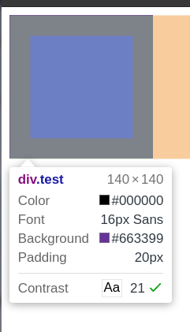
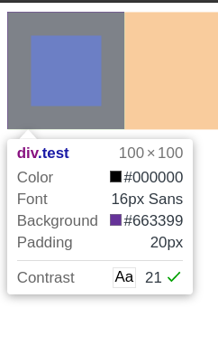

---
sidebar:
 title: 盒模型
 step: 6
isTimeLine: true
title: 盒模型
date: 2020-04-14
tags:
 - 大前端
 - CSS
categories:
 - 大前端
---
# 盒模型
浏览器展现一个元素时，这个元素会占据一定的空间,这个元素可以看做是一个盒子，封装周围的HTML元素。这个空间由四部分组成。
* 边距(margin):清除边框外的区域，外边距是透明的。
* 边框(border):围绕在内边距和内容外的边框。
* 填充(padding):清除内容周围的区域，内边距是透明的。
* 实际内容(context):盒子的内容,显示文本和图像

## box-sizing
用来设置width与height的作用对象,属性有:
* ``content-box``
* padding-box
* border-box

更符合实际生活逻辑的是 border-box

例子
```html
<div class='test'></div>
```
```css
.test{
    width:100px;
    height:100px;
    padding:20px;
}
```
此时的元素实际宽度为140px



当设置为 ``border-box`` 时才会是预期的结果


## 全局设置
推荐全局使用border-box
```css
*,
*::before,
*::after{
    box-sizing:border-box;
}
```

继承写法
```css
html{
    box-sizing:border-box;
}
*,
*::before,
*::after{
    box-sizing:inherit;
}
```
