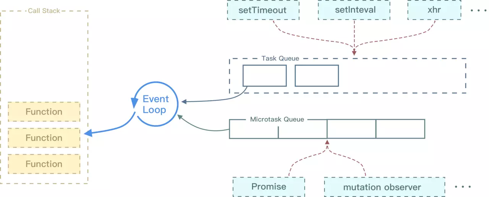

---
sidebar:
 title: Event Loop
 step: 12
isTimeLine: true
title: EventLoop
date: 2020-04-14
tags:
 - 大前端
 - javascript
categories:
 - 大前端
---
# Event Loop

* Event Loop是一个执行模型，在不同的地方有不同的实现
* Event Loop是一个程序结构，用于等待和发送消息和事件

**关于浏览器中的Event loop 请跳转这里查看更详细的内容** [戳我](./../browser/eventloop.md)
## 进程与线程

模拟场景
* 有一个工厂
* 工厂里有多个车间,但每次只有一个车间在工作
* 每个车间有若干房间,若干工人在流水线工作

那么
* 工厂 --> CPU
* 多个工厂 --> 多核CPU
* 车间 --> 进程  : 同一个时间只能有一个进程运行
* 工人 --> 线程 : 多个线程可以协同完成一个任务
* 车间(进程)中的房间 --> 内存

本质上讲,两个名词都是 CPU 工作时间片的一个描述
* 进程:运行指令及加载和保存上下文所需要的时间
* 线程:执行一段指令所需时间


在浏览器中
* 一个tab是一个进程
* 一个tab中有多个线程同时执行
* js是单线程运行
* 浏览器页面是多线程:渲染线程,js线程,http请求线程,发起一个请求等价于创建一个线程

单线程优势
* 节省内存
* 节约上下文(运行的环境本身)切换时间
* 没有锁的问题

## 执行栈
### 什么是执行栈?
执行栈可以认为是一个存储函数调用的``栈结构``，遵循先进后出的原则。

js开始执行代码的时候会首先创建一个``main``函数,然后根据执行的代码,根据先进后出的原则,后执行的函数先弹出栈

示例
```js
function a(v){
    return v*4
}
function b(v){
    return a(v*3)
}
console.log(b(2))
```
进栈顺序
```sh
1. main()
2. console.log(b(2))
3. b(2)
4. a(6)
```
出栈顺序
```sh
1. a(6)  // 24
2. b(2)  // 24
3. console.log(b(2)) // 24
4. main()
```

使用递归的时候，因为栈可存放的函数是有限制的，一旦存放了过多的函数且没有得到释放的话，就会出现爆栈

## 浏览器中的 Event Loop

执行 JS 代码的时候其实就是往执行栈中放入函数,当遇到异步的代码时，会被挂起并在需要执行的时候加入到 Task（有多种 Task） 队列中,一旦执行栈为空，Event Loop 就会从 Task 队列中拿出需要执行的代码并放入执行栈中执行，所以本质上来说 JS 中的异步还是同步行为

不同任务源会被分到不同的Task队列中
### 任务源
* 微任务(microtask):jobs
* 宏任务(macrotask):tasks

执行顺序示例
```js
console.log('script start')

async function async1() {
  await async2()
  console.log('async1 end')
}
async function async2() {
  console.log('async2 end')
}
async1()

setTimeout(function() {
  console.log('setTimeout')
}, 0)

new Promise(resolve => {
  console.log('Promise')
  resolve()
})
  .then(function() {
    console.log('promise1')
  })
  .then(function() {
    console.log('promise2')
  })

console.log('script end')
// script start --> async2 end --> Promise --> script end --> promise1 --> promise2
// async1 end --> setTimeout
```
新的浏览器中不是如上打印的，因为 await 变快了
```js
// script start --> async2 end --> Promise --> script end --> async1 end
//  promise1 --> promise2 --> setTimeout
```
1. 当我们调用 async1 函数时，会马上输出 async2 end，并且函数返回一个 Promise
2. 接下来在遇到 await的时候会就让出线程开始执行 async1 外的代码
3. 可以把 await 看成是让出线程的标志
4. 当同步代码全部执行完毕以后，就会去执行所有的异步代码
5. 回到 await 的位置执行返回的 Promise 的 resolve 函数
6. 这又会把 resolve 丢到微任务队列中
7. 接下来去执行 then 中的回调，当两个 then 中的回调全部执行完毕以后
8. 回到 await 的位置处理返回值
9. 可以看成是 Promise.resolve(返回值).then()，await 后的代码全部被包裹进了 then 的回调中，所以 console.log('async1 end') 会优先执行于 setTimeout。

如果 await 后面跟着 Promise 的话，async1 end 需要等待三个 tick 才能执行到。

### Event Loop执行顺序
* 同步代码
* 执行完所有同步代码后，执行栈为空，查询是否有异步代码需要执行
* 执行 微任务,如果在执行microtask的过程中，又产生了microtask，那么会加入到队列的末尾，也会在这个周期被调用执行
* 执行完所有微任务后，如有必要会渲染页面:
  * 判断document是否需要更新:浏览器是 60Hz 的刷新率，每 16.6ms 才会更新一次。
  * 判断是否有 resize 或者 scroll 事件，有的话会去触发事件:所以 resize 和 scroll 事件也是至少 16ms 才会触发一次，并且**自带节流**功能。
  * 判断是否触发了 media query
  * 更新动画并且发送事件
  * 判断是否有全屏操作事件
  * 执行 requestAnimationFrame 回调
  * 执行 IntersectionObserver 回调，该方法用于判断元素是否可见，可以用于懒加载上，但是兼容性不好
  * 更新界面
* 然后开始下一轮 Event Loop，执行宏任务中的异步代码，也就是 setTimeout 中的回调函数

归纳
* 宏队列macrotask一次只从队列中取一个任务执行，执行完后就去执行微任务队列中的任务
* 微任务队列中所有的任务都会被依次取出来执行，直到microtask queue为空；
* 只要执行UI rendering，它的节点是在执行完所有的microtask之后，下一个macrotask之前，紧跟着执行UI render。


### 微任务
* promise
* MutationObserver
* process.nextTick（node）

### 宏任务
* script
* xhr
* setTimeout
* setInterval
* setImmediate(node)
* requestAnimationFrame(浏览器)
* I/O
* UI rendering(浏览器)

### 自测
自测试1
```js
console.log(1);

setTimeout(() => {
  console.log(2);
  Promise.resolve().then(() => {
    console.log(3)
  });
});

new Promise((resolve, reject) => {
  console.log(4)
  resolve(5)
}).then((data) => {
  console.log(data);
})

setTimeout(() => {
  console.log(6);
})

console.log(7)
```

<details>
  <summary><mark><font color=darkred>点击查看答案</font></mark></summary>
  <p> 输出结果</p>
  <pre><code>
  // 1 4 7 5 2 3 6
  </code></pre>
</details>

自测2
```js
console.log(1);

setTimeout(() => {
  console.log(2);
  Promise.resolve().then(() => {
    console.log(3)
  });
});

new Promise((resolve, reject) => {
  console.log(4)
  resolve(5)
}).then((data) => {
  console.log(data);

  Promise.resolve().then(() => {
    console.log(6)
  }).then(() => {
    console.log(7)

    setTimeout(() => {
      console.log(8)
    }, 0);
  });
})

setTimeout(() => {
  console.log(9);
})

console.log(10);
```
<details>
  <summary><mark><font color=darkred>点击查看答案</font></mark></summary>
  <p> 输出结果</p>
  <pre><code>
  // 1 4 10 5 6 7 2 3 9 8
  </code></pre>
</details>

## node中的Event Loop
Node 与 浏览器中的 Event Loop 完全不同

Node的Event Loop分为**6个阶段**,会按照**顺序**反复执行,每当进入某一个阶段的时候,都会从对应的回调队列中取出函数去执行


## timers
执行 ``setTimeout`` 与 ``setInterval``回调,由poll阶段控制

node中的定时器也是不准确的,只是**尽快执行**

## I/O
处理上一轮中少数未执行的 ``I/O``回调

## idle, prepare
内部实现

## poll
至关重要的阶段，这一阶段中，系统会做两件事情
1. 回到timer阶段执行回调
2. 执行I/O回调

判断是否设置了timer
* 是: 如果poll 队列为空，则会判断是否有 timer 超时，有的话就回到 timer 阶段执行回调
* 否:
  * 如果poll队列**不为空**,遍历回调队列并同步执行,直到队列为空或者达到系统限制
  * 如果**为空**
    * 如果**有**``setImmediate``回调需要执行,poll阶段会停止并进入``check阶段``执行回调
    * 如果**没有**``setImmediate``,会等待回调被加入的队列中并立即执行回调(超时防止一直等待下去)


## check
执行``setImmediate``回调

## close callbacks
执行 close 事件

## 例子
### 某些情况下定时器随机执行
```js
setTimeout(() => {
    console.log('setTimeout')
}, 1)
setImmediate(() => {
    console.log('setImmediate')
})
```
``setTimeout``可能在前,可能在后

**原因**
* ``setTimeout(fn,0)`` 等价于 ``setTimeout(fn,1)`` 源码决定
* 进入event loop 需要成本,如果准备时间超过1ms,timer阶段就会直接执行回调
* 如果准备时间小于1ms就先执行setImmediate

### 定时器执行顺序一定情况
**I/O回调中**
```js
const fs = require('fs')
fs.readFile(__filename, () => {
    setTimeout(() => {
        console.log('timeout');
    }, 0)
    setImmediate(() => {
        console.log('immediate')
    })
})
// timeout
// immediate
```
1. I/O回调在Poll阶段执行
2. 判断timer --> timers为空 --> 判断poll
3. poll为空 --> 有setimmediate --> poll阶段会停止并进入check阶段执行回调

**宏任务↑**

**微任务↓**
``微任务(microtask)``会在每个阶段完成前清空 微任务队列

## process.nextTick
>独立于 Event Loop 之外的，它有一个自己的队列，当每个阶段完成后，如果存在 nextTick 队列，就会清空队列中的所有回调函数，并且优先于其他 microtask 执行。

### 示例
```js
setTimeout(() => {
    console.log('timer1')
}, 0)

Promise.resolve().then(function () {
    console.log('promise1')
})

process.nextTick(() => {
    console.log('nextTick')
    process.nextTick(() => {
        console.log('nextTick')
        process.nextTick(() => {
            console.log('nextTick')
            process.nextTick(() => {
                console.log('nextTick')
            })
        })
    })
})
// nextTick
// nextTick
// nextTick
// nextTick
// promise1
// timer1
```
:::tip 参考
[从setTimeout-setInterval看JS线程](https://palmer.arkstack.cn/2017/12/%E4%BB%8EsetTimeout-setInterval%E7%9C%8BJS%E7%BA%BF%E7%A8%8B/)<br>
[什么是Event Loop](http://www.ruanyifeng.com/blog/2013/10/event_loop.html)<br>
[彻底弄得Event Loop](https://segmentfault.com/a/1190000016278115)
:::

