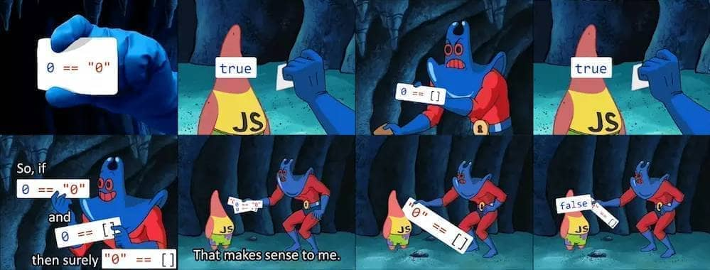
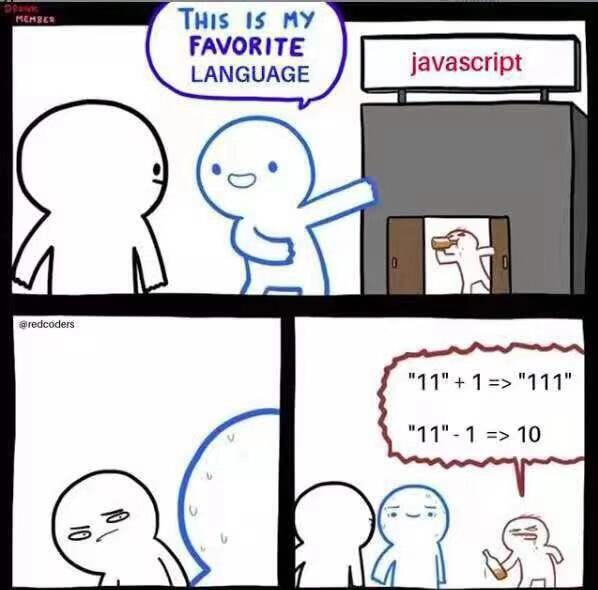
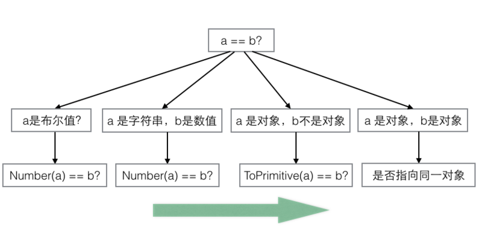

---
sidebar:
 title: 类型转换
 step: 27
isTimeLine: true
title: JavaScript中的类型转换规则
date: 2020-04-14
tags:
 - 大前端
 - javascript
categories:
 - 大前端
---
# JavaScript中的类型转换规则
先上两张有趣的网图:





可以看出，JavaScript的隐式类型转换是很有意思的（让人摸不着头脑）

同时面试中页通常会遇到类型转换的考（ba）题（gu），比如：
```js
// 哪些为真?
if([])
if({})
if([]==false)
if({}==false)
if([] == ![])
```
如果看着这题摸不着头脑，大伙儿可以接着往下看

本文**较完整**的梳理一下常见的类型`转换规则`与`转换场景`

**一点说明：** 文中的值类型等价于所说的基础类型，其范围是（boolean,string,number）

## 向基础类型转换
### 布尔Boolean
#### 转换为`boolean`的方式
常用的两种
* `!!value`：取反两次
* `Boolean(value)`：用Boolean包裹

#### 转换为假（false）
* `undefined`， `null`，`NaN`，`''`， `0` --> <font color="red">false</font>

<details>
<summary>
点击查看示例代码
</summary>

```js
console.log(!!undefined);
console.log(!!null);
console.log(!!NaN);
console.log(Boolean(''));
console.log(Boolean(0));
```
</details>

#### 转换为真（true）
* 除上述值外的`其它值类型`与`对象`都转为 --> <font color="#3eaf7c">true</font>

<details>
<summary>
点击查看示例代码
</summary>

```js
console.log(!!{});
console.log(!![]);
console.log(!!new Date());
console.log(Boolean(1));
console.log(Boolean('123'));
```
</details>

### 数字Number
#### 转换为`number`的方式
常用的两种
* `+value`：以`+`开头
* `Number(value)`：用Number包裹


#### 数组转数字
Array => Number
* 空数组转为0: `[]` --> <font color="#3eaf7c">0</font>
* 含有一个元素且为`数字`或`数字字符串`则转换为数字：`[1]`或`['1']` --> <font color="#3eaf7c">1</font>
* 其余情况转为`NaN`

<details>
<summary>
点击查看示例代码
</summary>

```js
console.log(+[]); // 0
console.log(+[1]); // 1
console.log(Number(['1.23'])); // 1.23
console.log(Number([1,2])); // NaN
console.log(Number(['1',2])); // NaN
```
</details>

#### 值类型转数字
* `null` --> <font color="#3eaf7c">0</font>
* `'123'` --> <font color="#3eaf7c">123</font>: 纯数字构成的字符串直接转换为应的数字
* `true` --> <font color="#3eaf7c">1</font>
* `false` --> <font color="#3eaf7c">0</font>
* `'124a'` --> <font color="red">NaN</font>
* `undefined` --> <font color="red">NaN</font>
* `Symbol` --> <font color="orange">**抛出错误**</font>

<details>
<summary>
点击查看示例代码
</summary>

```js
console.log(+null); // 0
console.log(+undefined); // NaN
console.log(+'123'); // 123
console.log(+'true'); // NaN
console.log(+true); // 1
console.log(+false);// 0
```
</details>

#### 引用类型转数字
除了上述的`数组`,`日期(Date)`之外的引用类型(`Object`)都转为`NaN`

<details>
<summary>
点击查看示例代码
</summary>

```js
console.log(+ new Date()); // 1623597270652
console.log(+ [1]); // 1
console.log(+ {}); // NaN
console.log(+ /\d/); // NaN
```
</details>

### 字符串String
#### 转字符串的方式
* 加空字符串:`’’ + value`
* String(value)：用`String`包裹

#### 值类型转字符串
* 数字直接转
  * `666` --> <font color="#3eaf7c">'666'</font>:
* 布尔值直接转换
  * `true` --> <font color="#3eaf7c">'true'</font>
  * `false` --> <font color="#3eaf7c">'false'</font>

<details>
<summary>
点击查看示例代码
</summary>

```js
console.log(''+true); // 'true'
console.log(''+false); // 'false'
console.log(String(666)); // '666'
```
</details>

#### 引用类型转数字
* 数组
  * `[]` --> <font color="#3eaf7c">''</font> ：空数组转为空串
  * `[2,'3']` --> <font color="#3eaf7c">'2,3'</font> ：非空数组的每一项转为字符串再用`,`分割
* 对象:
  * {} --> <font color="red">[object Object]</font>
  * {a:1} --> <font color="red">[object Object]</font>

<details>
<summary>
点击查看示例代码
</summary>

```js
console.log(String([])); // ''
console.log(String([1,2,'3'])); // '1,2,3'
console.log(String({})); // '[object Object]'
console.log(String({a:1})); // '[object Object]'
```
</details>

## 对象转基础类型规则
对象在转换类型的时候，会调用内置的 `[[ToPrimitive]]` 函数，对于该函数来说，逻辑一般来说如下：

1. 如果已经是基础类型了，那就不需要转换了
2. 目标类型为**字符串**就先调用 toString
   * 转换为基础类型的话就返回转换的值
3. 目标类型不为**字符串**就先调用 valueOf
   * 结果为基础类型，就返回转换的值
   * 结果不是基础类型的话再调用 toString
4. 如果都没有返回基础类型，就会报错

各种情况示例如下：

<details>
<summary>
点击查看示例代码
</summary>

```js
const demo1 = {
    [Symbol.toPrimitive]: function () {
        return 2
    }
}
// 情况1
console.log(demo1 + 1); // 3

const demo2 = {
    toString() {
        return 'demo2'
    },
    valueOf() {
        return 20
    }
}
// 情况2
console.log(String(demo2)) // demo2

// 情况3-1
console.log(demo2 - 3); // 17

const demo3 = {
    toString() {
        return 30
    },
    valueOf() {
        return {}
    }
}
// 情况3-2
console.log(demo3 - 4); // 26

const demo4 = {
    toString() {
        return {}
    },
    valueOf() {
        return {}
    }
}
// 情况4
console.log(demo4 + 1); // 报错
```

</details>

## 四则运算规则中的类型转换
### 加法

* 有一方为`String`，那么另一方也会被转为`String`
* 一方为`Number`,另一方为原始值类型，则将原始值类型转换为`Number`
* 一方为`Number`,另一方为引用类型，双方都转为`String`

<details>
<summary>
点击查看示例代码
</summary>

```js
'123' + 4 // '1234'

123 + true // 124
123 + undefined // NaN
123 + null // 123

123 + [] //  '123'
123 + {} // '123[object Object]'
```
</details>

### 其它

除了加法的运算符来说（-，*，/），会将非`Number`类型转换为`Number`类型

## 比较运算符中的类型转换
==
1. `NaN`不等于任何其它类型
2. `Boolean` 与其它类型进行比较,`Boolean`转换为`Number`
3. `String` 与 `Number`进行比较,`String` 转化为`Number`
4. `null` 与 `undefined`进行比较结果为<font color="#3eaf7c">true</font>
5. `null`,`undefined`与其它任何类型进行比较结果都为<font color="red">false</font>
6. `引用类型`与`值类型`进行比较,引用类型先转换为`值类型`(调用[ToPrimitive])
7. `引用类型`与`引用类型`，直接判断是否指向同一对象

>来源于参考资料中的网图



<details>
<summary>
点击查看示例代码
</summary>

```js
[]==![] // true
// [] == false  1. 根据运算符优先级 ![] --> false
// [] == 0      2. 上面规则2
// '' == 0      3. 上面规则6
//  0 == 0      4. 上面规则3
// 所以结果为true
```
</details>

## 自测
<details>
<summary>
点击查看自测代码
</summary>

```js
if ([]) console.log(1);
if ({}) console.log(2);
if ([] == false) console.log(3);
if ({} == false) console.log(4);
if ([] == ![]) console.log(5);
if ({} == !{}) console.log(6);
if ('' == false) console.log(7);
if (false == 0) console.log(8);
if (1 == true) console.log(9);
if ('' == 0) console.log(10);
if (NaN == NaN) console.log(11);
if ([] == !true) console.log(12);
if ([] == false) console.log(13);
if ([] == 0) console.log(14);
if (+0 == -0) console.log(15);
if (NaN == false) console.log(16);
```

```js
{ } +1
1 + {}
[] + 1
1 + []
[1, 2, 3] + 0
[1, 2, 3] + '0'
1 + '0'
1 + 0
1 + true
1 + false
'1' + true
'1' + false
![] + []
1 - true
'0' - 0
0 - '1'
false - true
{ } -[]
[] - {}
false - []
```
</details>


## TODO
* 补图：用图概括文章内容


:::tip 参考

[思否-前端碎碎念 之 为什么[] == ![] ?](https://segmentfault.com/a/1190000008594792)

[freeCodeCamp-Javascript 隐式类型转换，一篇就够了](https://chinese.freecodecamp.org/news/javascript-implicit-type-conversion/)
:::

