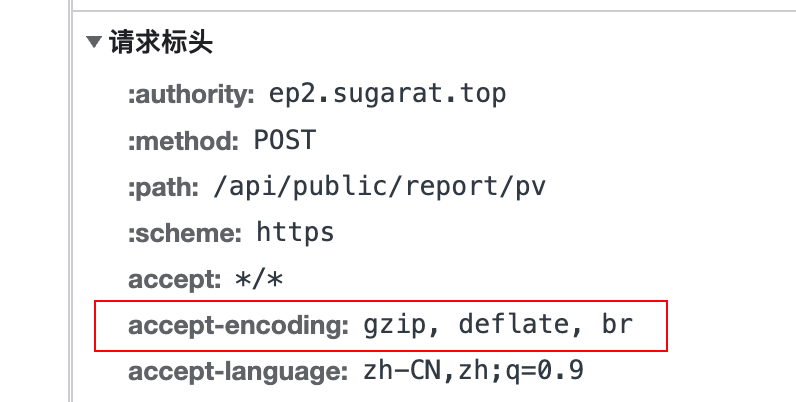
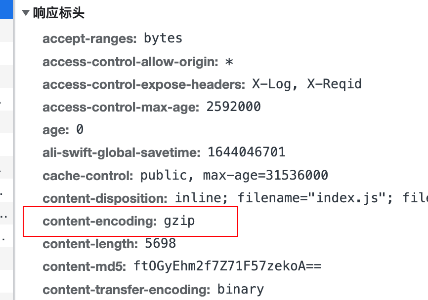

# Node侧实现内容压缩(gzip/br/deflate)介绍与实践

## 背景
在查看自己的[应用](https://ep2.sugarat.top/)日志时，发现进入日志页面后总是要几秒钟才会加载（接口没做分页），于是打开网络面板查看


这才发现接口返回的数据都没有被压缩，本以为接口用Nginx反向代理了，Nginx会自动帮我做这一层（这块后面探究一下，理论上是可行的）

这里的后端是 Node 服务

本文就分享一下 `HTTP数据压缩`相关知识以及笔者的在`Node侧的实践`

## 前置知识

>下面的客户端均指浏览器
### accept-encoding


客户端在向服务端发起请求时，会在请求头(request header)中添加`accept-encoding`字段，其值标明客户端`支持的压缩内容编码`格式

### content-encoding


服务端在对返回内容执行压缩后，通过在响应头（response header）中添加`content-encoding`，来告诉浏览器内容`实际压缩使用的编码算法`

### deflate/gzip/br

`deflate`是同时使用了`LZ77`算法与`哈夫曼编码（Huffman Coding）`的一个无损数据压缩算法。

`gzip` 是基于 `DEFLATE` 的算法

`br`指代`Brotli`，该数据格式旨在进一步提高压缩比，对文本的压缩相对`deflate`能增加`20%`的压缩密度，而其压缩与解压缩速度则大致不变

## zlib模块
Node.js包含一个`zlib 模块`，提供了使用 `Gzip`、`Deflate/Inflate`、以及 `Brotli` 实现的压缩功能

这里以`gzip`为例分场景列举多种使用方式，`Deflate/Inflate`与`Brotli`使用方式一样，只是API不一样

**基于`stream`的操作**


**基于`buffer`的操作**


引入几个所需的模块
```js
const zlib = require('zlib')
const fs = require('fs')
const stream = require('stream')
const testFile = 'tests/origin.log'
const targetFile = `${testFile}.gz`
const decodeFile = `${testFile}.un.gz`
```

## 文件的解/压缩
解/压缩结果查看，这里使用`du`指令直接统计解压缩前后结果
```sh
# 执行
du -ah tests

# 结果如下
108K    tests/origin.log.gz
2.2M    tests/origin.log
2.2M    tests/origin.log.un.gz
4.6M    tests
```

### 基于`流(stream)`的操作
使用`createGzip`与`createUnzip`
* 注：所有 `zlib` API，除了那些显式同步的 API，都使用 Node.js 内部线程池，可以看做是异步的
* 因此下面的示例中的压缩和解压代码应分开执行，否则会报错

**方式1：** 直接利用实例上的`pipe`方法传递流
```js
// 压缩
const readStream = fs.createReadStream(testFile)
const writeStream = fs.createWriteStream(targetFile)
readStream.pipe(zlib.createGzip()).pipe(writeStream)

// 解压
const readStream = fs.createReadStream(targetFile)
const writeStream = fs.createWriteStream(decodeFile)
readStream.pipe(zlib.createUnzip()).pipe(writeStream)
```

**方式2：** 利用`stream`上的`pipeline`，可在回掉中单独做其它的处理
```js
// 压缩
const readStream = fs.createReadStream(testFile)
const writeStream = fs.createWriteStream(targetFile)
stream.pipeline(readStream, zlib.createGzip(), writeStream, err => {
    if (err) {
        console.error(err);
    }
})

// 解压
const readStream = fs.createReadStream(targetFile)
const writeStream = fs.createWriteStream(decodeFile)
stream.pipeline(readStream, zlib.createUnzip(), writeStream, err => {
    if (err) {
        console.error(err);
    }
})
```

**方式3：** Promise化`pipeline`方法
```js
const { promisify } = require('util')
const pipeline = promisify(stream.pipeline)

// 压缩
const readStream = fs.createReadStream(testFile)
const writeStream = fs.createWriteStream(targetFile)
pipeline(readStream, zlib.createGzip(), writeStream)
    .catch(err => {
        console.error(err);
    })

// 解压
const readStream = fs.createReadStream(targetFile)
const writeStream = fs.createWriteStream(decodeFile)
pipeline(readStream, zlib.createUnzip(), writeStream)
    .catch(err => {
        console.error(err);
    })
```

### 基于`Buffer`的操作
利用 `gzip` 与 `unzip` API，这两个方法包含`同步`与`异步`类型
* 压缩
  * `gzip`
  * `gzipSync`
* 解压
  * `unzip`
  * `unzipSync`

**方式1：** 将`readStream`转`Buffer`,然后进行进一步操作
* gzip：异步
```js
// 压缩
const buff = []
readStream.on('data', (chunk) => {
    buff.push(chunk)
})
readStream.on('end', () => {
    zlib.gzip(Buffer.concat(buff), targetFile, (err, resBuff) => {
        if(err){
            console.error(err);
            process.exit()
        }
        fs.writeFileSync(targetFile,resBuff)
    })
})
```
* gzipSync：同步
```js
// 压缩
const buff = []
readStream.on('data', (chunk) => {
    buff.push(chunk)
})
readStream.on('end', () => {
    fs.writeFileSync(targetFile,zlib.gzipSync(Buffer.concat(buff)))
})
```

**方式2：** 直接通过`readFileSync`读取
```js
// 压缩
const readBuffer = fs.readFileSync(testFile)
const decodeBuffer = zlib.gzipSync(readBuffer)
fs.writeFileSync(targetFile,decodeBuffer)

// 解压
const readBuffer = fs.readFileSync(targetFile)
const decodeBuffer = zlib.gzipSync(decodeFile)
fs.writeFileSync(targetFile,decodeBuffer)
```

## 文本内容的解/压缩
除了对文件压缩，有时候也许要对传输的内容进行直接进行解压缩

这里以压缩文本内容为例
```js
// 测试数据
const testData = fs.readFileSync(testFile, { encoding: 'utf-8' })
```

### 基于`流(stream)`操作
这块就考虑 `string` =>  `buffer` => `stream`的转换就行

`string` =>  `buffer`
```js
const buffer = Buffer.from(testData)
```

`buffer` => `stream`
```js
const transformStream = new stream.PassThrough()
transformStream.write(buffer)

// or
const transformStream = new stream.Duplex()
transformStream.push(Buffer.from(testData))
transformStream.push(null)
```

这里以写入到文件示例，当然也可以写到其它的流里，如`HTTP的Response`（后面会单独介绍）
```js
transformStream
    .pipe(zlib.createGzip())
    .pipe(fs.createWriteStream(targetFile))
```

### 基于`Buffer`操作
同样利用`Buffer.from`将字符串转`buffer`
```js
const buffer = Buffer.from(testData)
```

然后直接使用同步API进行转换，这里result就是压缩后的内容
```js
const result = zlib.gzipSync(buffer)
```

可以写入文件，在`HTTP Server`中也可直接对压缩后的内容进行返回
```js
fs.writeFileSync(targetFile, result)
```

## Node Server中的实践
这里直接使用Node中 `http` 模块创建一个简单的 Server 进行演示

在其他的 `Node Web` 框架中，处理思路类似，当然一般也有现成的插件，一键接入


```js
const http = require('http')
const { PassThrough, pipeline } = require('stream')
const zlib = require('zlib')

// 测试数据
const testTxt = '测试数据123'.repeat(1000)

const app = http.createServer((req, res) => {
    const { url } = req
    // 读取支持的压缩算法
    const acceptEncoding = req.headers['accept-encoding'].match(/(br|deflate|gzip)/g)

    // 默认响应的数据类型
    res.setHeader('Content-Type', 'application/json; charset=utf-8')

    // 几个示例的路由
    const routes = [
        ['/gzip', () => {
            if (acceptEncoding.includes('gzip')) {
                res.setHeader('content-encoding', 'gzip')
                // 使用同步API直接压缩文本内容
                res.end(zlib.gzipSync(Buffer.from(testTxt)))
                return
            }
            res.end(testTxt)
        }],
        ['/deflate', () => {
            if (acceptEncoding.includes('deflate')) {
                res.setHeader('content-encoding', 'deflate')
                // 基于流的单次操作
                const originStream = new PassThrough()
                originStream.write(Buffer.from(testTxt))
                originStream.pipe(zlib.createDeflate()).pipe(res)
                originStream.end()
                return
            }
            res.end(testTxt)
        }],
        ['/br', () => {
            if (acceptEncoding.includes('br')) {
                res.setHeader('content-encoding', 'br')
                res.setHeader('Content-Type', 'text/html; charset=utf-8')
                // 基于流的多次写操作
                const originStream = new PassThrough()
                pipeline(originStream, zlib.createBrotliCompress(), res, (err) => {
                    if (err) {
                        console.error(err);
                    }
                })
                originStream.write(Buffer.from('<h1>BrotliCompress</h1>'))
                originStream.write(Buffer.from('<h2>测试数据</h2>'))
                originStream.write(Buffer.from(testTxt))
                originStream.end()
                return
            }
            res.end(testTxt)
        }]
    ]
    const route = routes.find(v => url.startsWith(v[0]))
    if (route) {
        route[1]()
        return
    }

    // 兜底
    res.setHeader('Content-Type', 'text/html; charset=utf-8')
    res.end(`<h1>404: ${url}</h1>
    <h2>已注册路由</h2>
    <ul>
        ${routes.map(r => `<li><a href="${r[0]}">${r[0]}</a></li>`).join('')}
    </ul>
    `)
    res.end()
})

app.listen(3000)
```
## 参考
* [掘金:Node.js 流（stream）：你需要知道的一切](https://juejin.cn/post/6844903618441641991#heading-2)
* [掘金:Node.js实战--资源压缩与zlib模块](https://juejin.cn/post/6844904062974951437#heading-1)
* [segmentfault:使用Brotli提高网站访问速度](https://segmentfault.com/a/1190000009374437)
* [美团技术团队:速度与压缩比如何兼得？压缩算法在构建部署中的优化](https://tech.meituan.com/2021/01/07/pack-gzip-zstd-lz4.html)
* [Node.js v16.14.0 文档:zlib](http://nodejs.cn/api/zlib.html#zlib)
* [Github:ayqy/string-to-file-stream](https://github.com/ayqy/string-to-file-stream/blob/2f43145ca9515345fb0b9b697414bcfd0effe276/index.js)

