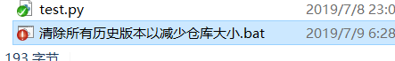
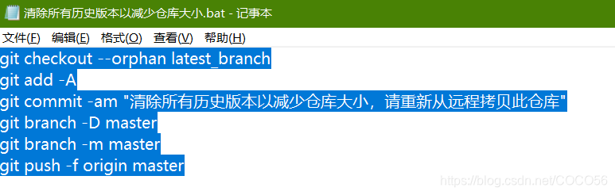

# 1. Git删除当前分支下的所有历史版本与log并同步至GitHub_git如何清除历史版本-CSDN博客

> ## Excerpt
> 文章目录1. 按2. 方法一2.1. 切换到latest_branch分支下2.2. 添加所有文件2.3. 提交更改2.4. 删除分支2.5. 将当前分支重命名2.6. 最后，强制更新存储库2.7. 技巧3. 方法二3.1. 先删除.git文件夹3.2. 然后初始化Git（user为你的用户名，repo为你的仓库名）3.3. 提交当前版本的代码1. 按保留大量的历史版本会给存储设施增加负荷，有时候我们需要删除之前的所有历史版本与log，仅保留当前版本的文件。删除master分支下的所有历史版本与log_git如何清除历史版本

#### 1.0.0.1. 文章目录

- [Git删除当前分支下的所有历史版本与log并同步至GitHub_git如何清除历史版本-CSDN博客](#git删除当前分支下的所有历史版本与log并同步至github_git如何清除历史版本-csdn博客)
      - [文章目录](#文章目录)
  - [1. 按](# -按)
  - [2. 方法一](# -方法一)
    - [2.1. 切换到latest_branch分支下](# -切换到latest_branch分支下)
    - [2.2. 添加所有文件](# -添加所有文件)
    - [2.3. 提交更改](# -提交更改)
    - [2.4. 删除分支](# -删除分支)
    - [2.5. 将当前分支重命名](# -将当前分支重命名)
    - [2.6. 最后，强制更新存储库](# -最后强制更新存储库)
    - [2.7. 技巧](# -技巧)
  - [3. 方法二](# -方法二)
    - [3.1. 先删除.git文件夹](# -先删除git文件夹)
    - [3.2. 然后初始化Git（user为你的用户名，repo为你的仓库名）](# -然后初始化gituser为你的用户名repo为你的仓库名)
    - [3.3. 提交当前版本的代码](# -提交当前版本的代码)

## 1.1. 按

保留大量的历史版本会给存储设施增加负荷，有时候我们需要删除之前的所有历史版本与log，仅保留当前版本的文件。

删除master分支下的所有历史版本与log，只保留当前的版本，并同步至[GitHub](https://github.com/cnjimbo/cnjimbo.github.io)

## 1.2. 方法一

先新建一个名为latest_branch的分支，然后将当前master分支中的所有文件添加到latest_branch分支中，接着等待移动完毕后删除master分支，最后把latest_branch这个分支的分支名改为master。

以下是具体实现：

### 1.2.1. 切换到latest_branch分支下

```powershell

git checkout --orphan latest_branch

```

### 1.2.2. 添加所有文件

```powershell
git add -A

```

### 1.2.3. 提交更改

```powershell
git commit -am "清除所有历史版本以减少仓库大小，请重新从远程拷贝此仓库"

```

### 1.2.4. 删除分支

```powershell
git branch -D master

```

### 1.2.5. 将当前分支重命名

```powershell
git branch -m master

```

### 1.2.6. 最后，强制更新存储库

```powershell
git push -f origin master

```

### 1.2.7. 技巧

将如下代码保存在一个bat文件里，然后双击运行即可。

```powershell
git checkout --orphan latest_branch
git add -A
git commit -am "清除所有历史版本以减少仓库大小，请重新从远程拷贝此仓库"
git branch -D master
git branch -m master
git push -f origin master

```




## 1.3. 方法二

不推荐使用，可能导致git存储库出现问题。思路：直接删除.git文件再初始化仓库

### 1.3.1. 先删除.git文件夹

### 1.3.2. 然后初始化Git（user为你的用户名，repo为你的仓库名）

```powershell

git init git remote add origin git@github.com:user/repo

```

### 1.3.3. 提交当前版本的代码

```powershell

git add * git commit -am 'message'

```

最后，强制更新到GitHub：

```powershell

git push -f origin master

```
