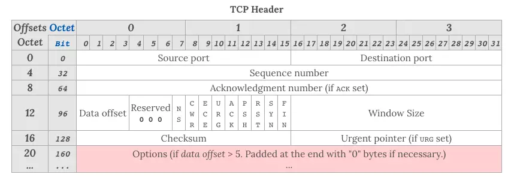
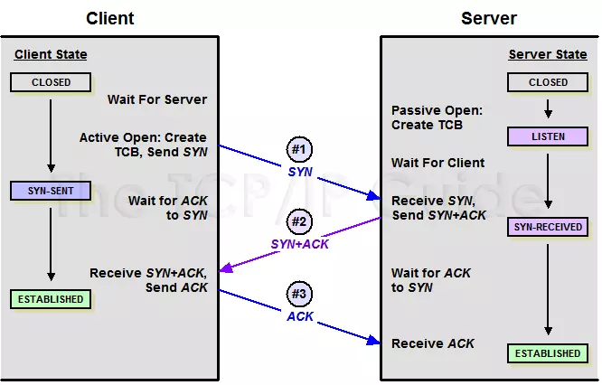

---
sidebar:
 title: TCP协议
 step: 1
isTimeLine: true
title: TCP协议
date: 2020-04-14
tags:
 - 计算机基础
 - 计算机网络
categories:
 - 计算机基础
---
# TCP协议

TCP 基本是和 UDP 反着来，建立连接断开连接都需要先需要进行握手。在传输数据的过程中，通过各种算法保证数据的可靠性，当然带来的问题就是相比 UDP 来说不那么的高效。

## 头部
TCP 头部比 UDP 头部复杂的多

* Sequence number:这个序号保证了 TCP 传输的报文都是有序的，对端可以通过序号顺序的拼接报文
* Acknowledgement Number:这个序号表示数据接收端期望接收的下一个字节的编号是多少，同时也表示上一个序号的数据已经收到
* Window Size:窗口大小，表示还能接收多少字节的数据，用于流量控制
* 标识符
  * URG=1：1表示本数据报的数据部分包含紧急信息，是一个高优先级数据报文，此时紧急指针有效。紧急数据一定位于当前数据包数据部分的最前面，紧急指针标明了紧急数据的尾部。
  * ACK=1：1表示确认号字段有效。此外，TCP 还规定在连接建立后传送的所有报文段都必须把 ACK 置1。
  * PSH=1：1表示接收端应该立即将数据 push 给应用层，而不是等到缓冲区满后再提交。
  * RST=1：1表示当前 TCP 连接出现严重问题，可能需要重新建立 TCP 连接，也可以用于拒绝非法的报文段和拒绝连接请求。
  * SYN=1：当SYN=1，ACK=0时，表示当前报文段是一个连接请求报文。当SYN=1，ACK=1时，表示当前报文段是一个同意建立连接的应答报文。
  * FIN=1：1表示此报文段是一个释放连接的请求报文。

## 状态机

### 建立连接三次握手

假设:
* 主动发起请求的一端称为**客户端**
* 被动连接的一端称为**服务端**

不管是客户端还是服务端，TCP 连接建立完后都能发送和接收数据，所以 TCP 是一个全双工的协议。

起初，两端都为 CLOSED 状态。在通信开始前，双方都会创建 TCB。 服务器创建完 TCB 后便进入 LISTEN 状态，此时开始等待客户端发送数据。

* 第一次握手
  * 客户端发送SYN(同步序列编号 seq=j)包到服务端并进入SYN_SEND(请求连接)状态,等待服务端响应
  * 客户端向服务端发送连接请求报文段。该报文段中包含自身的数据通讯初始序号。请求发送后，客户端便进入 SYN-SENT 状态。
* 第二次握手
  * 服务端收到SYN包后，也会发送一个SYN包给客户端，这个包里面带有ACK(确认字符)=j+1用来确认客户端的SYN，和自己的SYN(seq=K)，服务端进入SYN_RECV状态
  * 服务端收到连接请求报文段后，如果同意连接，则会发送一个应答，该应答中也会包含自身的数据通讯初始序号，发送完成后便进入 SYN-RECEIVED 状态。
* 第三握手
  * 客户端收到服务端的SYN+ACK包后，再向服务端发送确认包ACK（ACK=k+1），发送完毕，A和B进入ESTABLISHED状态，完成三次握手
  * 当客户端收到连接同意的应答后，还要向服务端发送一个确认报文。客户端发完这个报文段后便进入 ESTABLISHED 状态，服务端收到这个应答后也进入 ESTABLISHED(建立成功) 状态，此时连接建立成功。

### 断开连接四次握手

TCP 是全双工的，在断开连接时两端都需要发送 FIN 和 ACK。

* 第一次握手

客户端 A 认为数据发送完成，则它需要**向服务端 B 发送连接释放请求**

* 第二次握手

**服务端B收到请求,告诉应用层要释放 TCP 链接**。然后会发送 ACK 包，并进入 CLOSE_WAIT 状态，此时表明 A 到 B 的连接已经释放，不再接收 A 发的数据了。但是因为 TCP 连接是双向的，此时B 仍旧可以发送数据给 A。

* 第三次握手

服务端B 如果此时还有没发完的数据会继续发送，完毕后**向 A 发送连接释放请求**,然后 B 便进入 LAST-ACK 状态。

* 第四次握手

**A 收到释放请求后，向 B 发送确认应答**，此时 A 进入 TIME-WAIT 状态。该状态会持续 2MSL（最大段生存期，指报文段在网络中生存的时间，超时会被抛弃） 时间，若该时间段内没有 B 的重发请求的话，就进入 CLOSED 状态。当 B 收到确认应答后，也便进入 CLOSED 状态。

### 为什么 TCP 建立连接需要三次握手，明明两次就可以建立起连接?
* 防止出现失效的连接请求报文段被服务端接收的情况，从而产生错误
* 如果只有一次:客户端发送连接请求后，没有收到服务端的应答，是没法判断连接是否成功的
* 如果只有两次:客户端发送连接请求后，等待服务器端的应答。如过客户端的SYN过了一段时间没有到达服务器端，客户端链接超时，会重新发送一次连接，如果重发的这次服务器端收到了，且应答了客户端，连接就建立了。但是建立后，第一个SYN也到达服务端了，这时服务端会认为这是一个新连接，会再给客户端发送一个ACK，这个ACK当然会被客户端丢弃。但是此时服务器端已经为这个连接分配资源了，而且服务器端会一直维持着这个资源，会造成浪费

### 三次握手过程中可以携带数据么？
* 第三次握手的时候，可以携带
  * 客户端已经处于ESTABLISHED状态,已经能够确认服务器的接收、发送能力正常,这个时候相对安全，可以携带数据。
* 前两次握手不能携带数据
  * 一旦有人想攻击服务器，只需要在第一次握手中的 SYN 报文中放大量数据，那么服务器会消耗更多的时间和内存空间去处理这些数据，增大了服务器被攻击的风险

### 为什么 A 要进入 TIME-WAIT 状态，等待 2MSL 时间后才进入 CLOSED 状态？
``MSL`` -- ``Maximum Segment Lifetime`` -- 报文最大生存时间,最长报文寿命
1. 为了保证 B 能收到 A 的确认应答,即为了保证A发送的最后一个ACK报文能够到达B
   * 若 A 发完确认应答后直接进入 CLOSED 状态，如果确认应答因为网络问题一直没有到达，那么会造成 B 不能正常关闭。
2. 如果不等待，A直接关闭，当B还有数据包要发送给客户端时，且还在传输的路上，若客户端的端口此时刚好被新的应用占用，那么就接收到了无用数据包，造成数据包混乱
3. 2MSL意义:
   * 1 个 MSL 确保四次挥手中主动关闭方最后的 ACK 报文最终能达到对端
   * 1 个 MSL 确保对端没有收到 ACK 重传的 FIN 报文可以到达
   * 经过2MSL,可以使本链接持续时间内所产生的所有报文段,都从网络中消失

## 适合场景
* HTTP
* FTP
* SMTP
* 文件传输
* 游戏

## ARQ 协议
超时重传机制

通过确认和超时机制保证了数据的正确送达，ARQ 协议包含停止等待 ARQ 和连续 ARQ 两种协议。

### 停止等待 ARQ
..未完待续
### 连续 ARQ
...未完待续

:::tip 参考
[网络-TCP](https://yuchengkai.cn/docs/cs/#tcp)
:::

