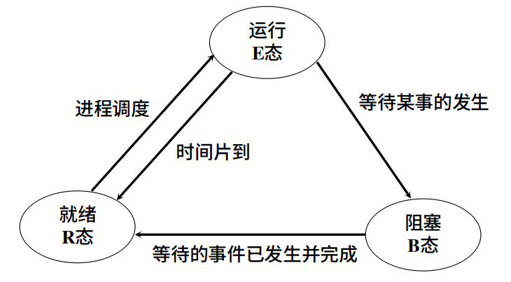

---
sidebar:
 title: 进程
 step: 0
isTimeLine: true
title: 进程
date: 2020-04-14
tags:
 - 计算机基础
 - 操作系统
categories:
 - 计算机基础
---
# 进程
>系统进行资源分配和调度的一个独立单位。
* 进程是可并发执行的程序在一个数据集合上的运行过程。
* 进程是指进程实体的运行过程。

## 特点
* 结构性:由程序(段),数据(段),进程控制块(PCB)三部分组成
* 动态性:进程是程序的执行过程
* 并发性:多个进程可同时存在于内存中,能在一段时间内同时运行
* 独立性:独立运行的基本单位,独立获得资源与调度的基本单位
* 异步性:各自的进程独立的按不可预知的速度推进
## 状态
* 运行(Running):占用CPU且正在CPU上运行
* 就绪(Ready):已具备运行条件(获取了除CPU以外的其它所需资源),但CPU没有空闲
* 等待/阻塞/睡眠(Waiting/Blocked):因等待某一事件而不能运行

## 低级调度
* 非抢占式调度:不允许某进程抢占已经分配出去的处理机。
* 抢占式调度:允许调度程序根据某种原则，暂停正在执行的进程，将处理机重新分配给另一进程。
  * 原则:
    * 优先权原则
    * 短作业（进程）优先原则
    * 时间片原则

## 切换
>为了控制进程的执行，内核必须有能力挂起正在CPU上执行的进程，并恢复以前挂起的某个进程的执行，这叫做进程切换、任务切换、上下文切换
1. 保存被中断进程的上下文
2. 转向进程调度
3. 恢复待运行进程的上下文
