# 博客性能优化笔记 | 99分

闲着没事，拿 lighthouse 测了一下博客网站的性能评测，发现诊断出的问题还挺多，就顺手优化了一下。

这篇文章将记录这个优化的过程。

## 优化前后对比
lighthouse 检测结果

|                                     优化前                                      |                                     优化后                                      |
| :-----------------------------------------------------------------------------: | :-----------------------------------------------------------------------------: |
|  |  |

性能面板检测结果

|        |  FCP  | DOMContentLoaded |  LCP   |
| :----: | :---: | :--------------: | :----: |
| 优化前 | 764ms |      1798ms      | 1864ms |
| 优化后 | 496ms |      507ms       | 496ms  |

* FCP（First Contentful Paint）
* LCP（Largest Contentful Paint）

## 检测工具
使用 Chrome 自带的 lighthouse 和 性能面板进行测试。

|                                    性能面板                                     |                                   lighthouse                                    |
| :-----------------------------------------------------------------------------: | :-----------------------------------------------------------------------------: |
| 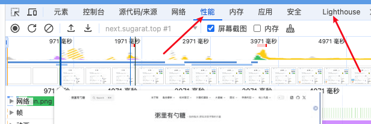 |  |

## 发现问题

### 性能面板 | Performance
*通过截图可以观察到每个时间的页面变化*

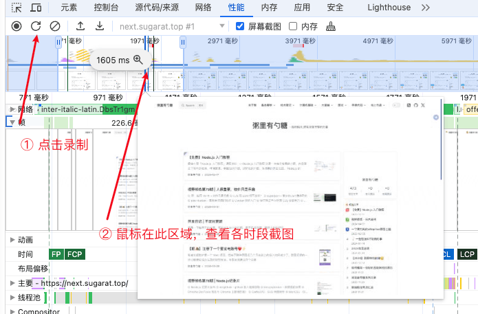

发现的问题：
1. 文章列表渲染后，文章封面图加载缓慢
2. 图片完成加载时间过长（封面，头像图片）
3. 布局渲染期间发生明显变化
  * 友链列表加载完成后
  * 左上头像加载完成

### lighthouse

测试后会给到优化建议。

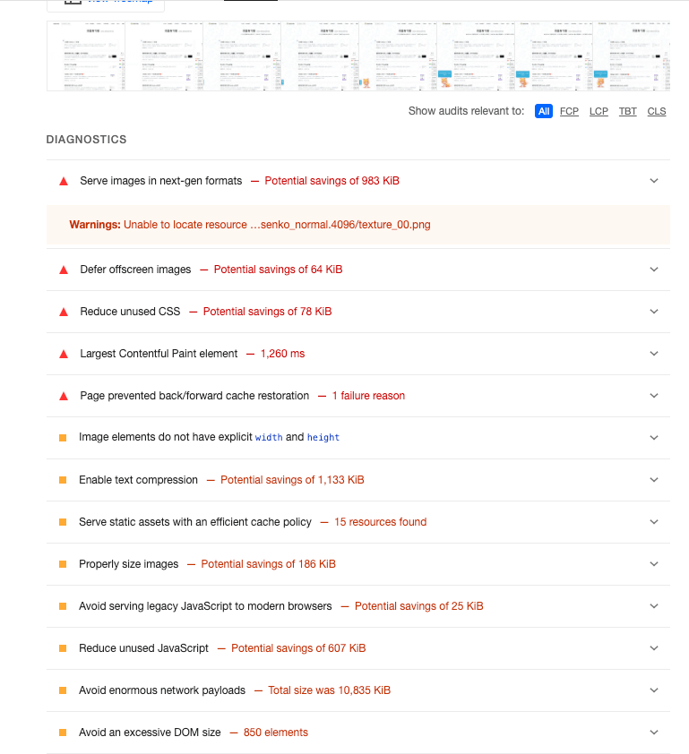

这里挑一些后面用到的

4. 使用新的图片格式（WebP and AVIF）
5. 减少没用到的CSS文件大小
6. img 没有明确的宽高属性
7. 资源传输压缩（gzip, brotli 等）
8. 加载适当大小的图片（避免超过要展示的大小）
9. 避免超大的资源加载阻塞网络（主要是一些超大的图片和js）

## 优化过程
### 图片优化
*解决：1，2，4，8，9*

① 裁剪为渲染的大小

② 格式调整为WebP格式

我的图片都是放在图床上的（[七牛云](https://www.qiniu.com/)，[又拍云](https://www.upyun.com/)，[缤纷云](https://www.bitiful.com/)）。

这一步我直接使用 OSS（对象存储） 提供的图片加载裁剪功能即可。

配置目标：`宽高裁剪为 120px * 80px`，格式调整为 `WebP` 格式。

配置处理样式示例

|                                     七牛云                                      |                                     又拍云                                      |                                     缤纷云                                      |
| :-----------------------------------------------------------------------------: | :-----------------------------------------------------------------------------: | :-----------------------------------------------------------------------------: |
| 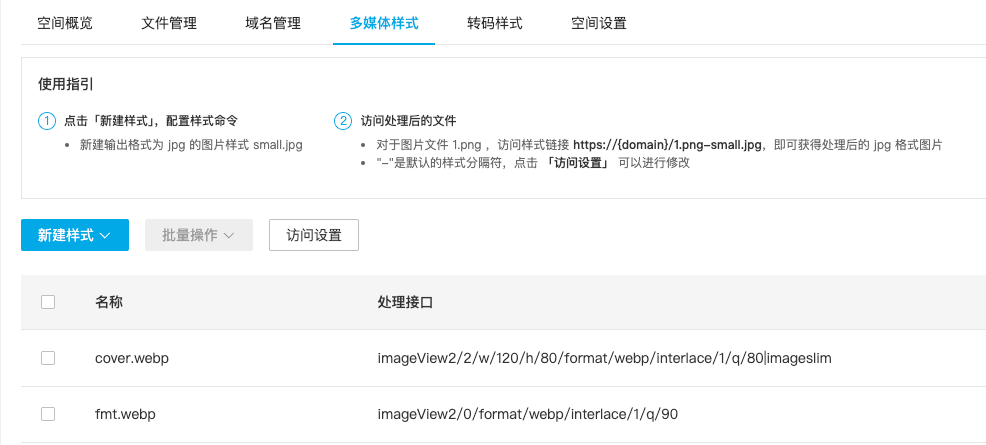 | 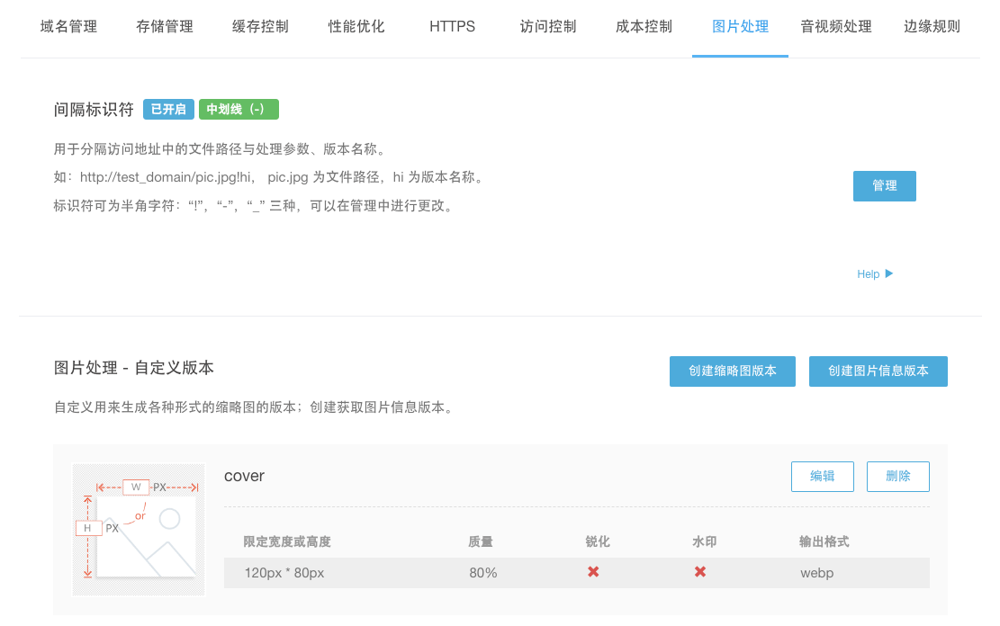 | 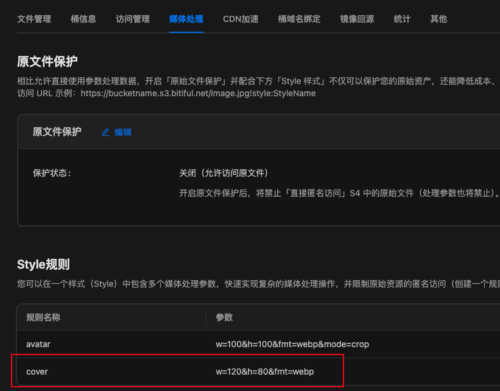 |

使用：在原有的资源上添加对应的后置即可
* 七牛云：url`~cover.webp`
* 又拍云：url`-cover`
* 缤纷云：url`!style:cover`

代码中的体现↓
|                                      封面                                       |                                    友链头像                                     |                                      头像                                       |
| :-----------------------------------------------------------------------------: | :-----------------------------------------------------------------------------: | :-----------------------------------------------------------------------------: |
| 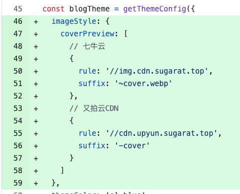 |  |  |

### oml2d模型资源优化
博客左下角的看板娘加载优化。

*解决：9*

① 资源全部放在自己的 OSS 通过CDN加载（有gzip压缩，更快的访问速度）

② 将模型用到的PNG图片压缩

使用之前做的[图片在线压缩工具](https://demos.sugarat.top/pages/png-compress/)

压缩后减少了 88% 的体积，视觉上看不出变化。

### 网络优化
*解决：7，9*

① 第三方资源使用 OSS存储 + CDN加载

② 访问使用 HTTP3/HTTP2

新的协议加载资源，用上多路复用的特性。

启用前提资源支持 HTTPS 访问（配置SSL证书），才能启用 HTTP2/3。

配置 HTTPS 时使用最新的 TLS1.3 版本，更快的加解密速度。

下面是在各平台开启相关配置示意。

|                                     七牛云                                      |                                     又拍云                                      |                                     缤纷云                                      |
| :-----------------------------------------------------------------------------: | :-----------------------------------------------------------------------------: | :-----------------------------------------------------------------------------: |
|  | 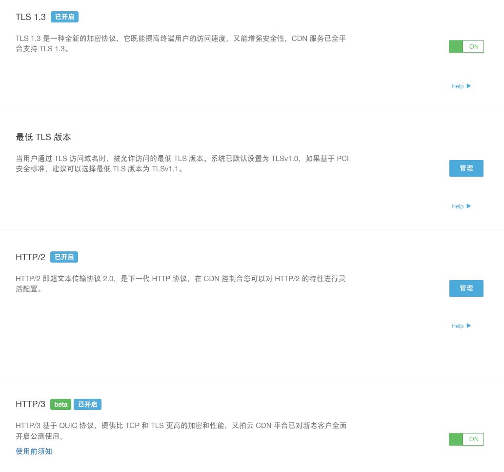 |  |

优化前后对比
|                                     优化前                                      |                                     优化后                                      |
| :-----------------------------------------------------------------------------: | :-----------------------------------------------------------------------------: |
|  | 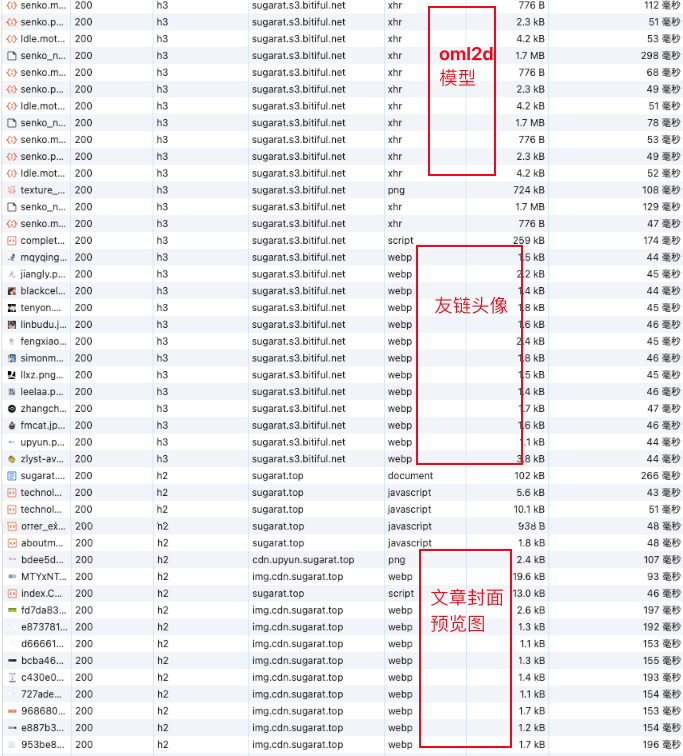 |

### 布局优化
*解决：3，6*

**目标：减少触发 “页面回流重绘” 的范围和次数。**

① 针对图片，限定具体渲染的宽高，避免图片加载后布局发生变化

② 针对后渲染区域，限定其容器的宽度，避免渲染后影响布局

### 减少无用代码
*解决：5*

① 移除无用的 js 脚本或者 CSS 资源

大概看了一下，项目里额外依赖的 element-plus 样式文件占大头。

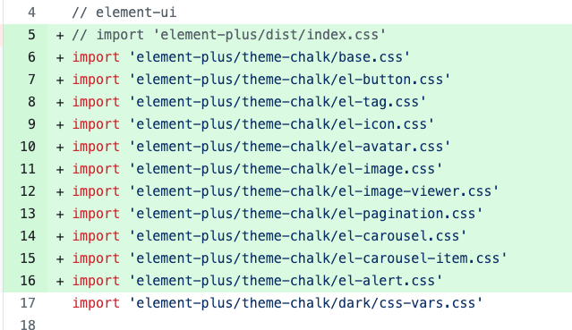

将全量引入，手动调整为按需引入。

## 最终效果
|                                    性能面板                                     |                                   lighthouse                                    |
| :-----------------------------------------------------------------------------: | :-----------------------------------------------------------------------------: |
| 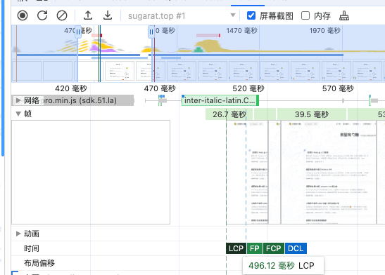 |  |

优化后的性能指标

* FCP（First Contentful Paint）：496ms
* DOMContentLoaded：507ms
* LCP（Largest Contentful Paint）：496ms

访问 https://www.dmsrs.org 可以看到效果还是很明显的。

## 总结
1. 图片：压缩，加载合适尺寸，优先使用 WebP 格式
2. 网络：HTTPS + HTTP2/3，OSS + CDN
3. 布局：减少回流重绘范围与次数
4. 资源：移除无用代码，无用的第三方资源加载
