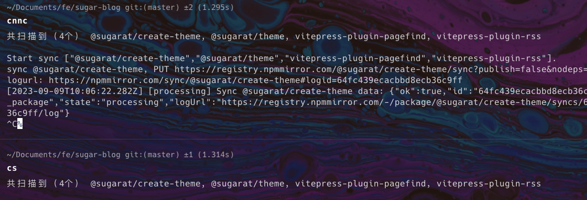

# 实现自动扫描工作区npm包并同步cnpm

**省流版: `npx cnnc`**

为避免包名重复，取了2个单词的首尾，*<span style="color:red">cn</span>pm sy<span style="color:red">nc</span>*

## 前言
在开发一个多npm包的项目时，时常会一次更新多个包的代码，再批量发布到 npm 镜像源后。

由于国内网络环境的原因，大部分都会使用[淘宝的镜像源](https://npmmirror.com/)进行依赖安装，为了确保发布后，通过淘宝源能够顺利的安装，通常会手动同步一下

`cnpm sync vue react`

但在一些大型的 monorepo 的多包工程里，手动输入包名是一件非常繁琐的事情，所以准备把输入的过程简化一下，改成自动扫描工作区的包名，然后自动同步。

进而有了这个工具

## 工具的使用
直接通过 npx 运行即可，将自动扫描所有的包

```sh
npx cnnc
```

[示例结果](https://app.warp.dev/block/wrTUBqnxdg65BqCTgtSgD5) 如下


当然也同样支持手动传入要更新的包

```sh
npx cncc vue react
```

如果使用频率较高，也可全局安装`npm i -g cnnc`

这样可以直接通过`cnnc`或`cs`命令调用



## 实现原理
核心代码不到20行，下面详细的拆解一下，便于学习与理解

主要分为3部分
* 工作区的包扫描
* 过滤出合法的包
* 调用 cnpm 同步

### 工作区的包扫描
主要目的就是扫描工作区所有的 `package.json` 文件，然后提取出包名（不包含 node_modules，build 等目录下的文件）

这里可以 `fs.readdirSync` 实现一个递归的扫描，也可以用[fast-glob](https://github.com/mrmlnc/fast-glob#readme)，图方便我这里选择后者，也是目前目录扫描用得较广泛的一个包

```js
const fg = require('fast-glob')

const pkgNames = []

// 通过glob 取所有package.json
fg.sync('./**/package.json', {
  ignore: [
    '**/node_modules',
    '**/dist',
    '**/build',
    '**/test',
    // 省略更多的无关目录...
  ],
  absolute: true
}).forEach((file) => {
  const { name } = require(file)
  pkgNames.push(name)
})
```
通常工作区里有很多无关的目录，比如`node_modules`、`build`、`dist`、`test`等，这些目录下的`package.json`都不需要同步，所以可以通过`ignore`参数来忽略掉，避免不必要的扫描（否则 node_modules 套 node_modules 会增加扫描时间，部分目录是软链的话也会导致扫描路径的异常）

### 过滤出合法的包
有些`package.json`会包含 `"private": true` 内容，表明为私有的包，不会发布到npm镜像源，所以需要过滤掉

```js
// 省略其它代码
globResult.forEach((file) => {
  const { name, private } = require(file)
  if (!private) {
    pkgNames.push(name)
  }
})
```

### 调用 cnpm 同步
最后一步就是调用`cnpm sync`命令，这里可以通过`child_process`模块来实现

通过`spawn`方法，可以直接调用命令行命令，然后通过`stdio: 'inherit'`将命令行的输出直接打印到终端中
```js
const { spawn } = require('child_process')
const { promisify } = require('util')
function CnpmSync(...names) {
  return promisify(spawn)('npx', ['cnpm', 'sync', ...names], {
    cwd: __dirname,
    stdio: 'inherit'
  })
}
```
为防止用户没有全局安装cnpm，这里通过`npx cnpm sync`的方式来调用，这样就不需要用户自己安装了

同时可以将`cnpm`作为包`dependencies`依赖安装，通过`cwd: __dirname`参数，将指令运行目录指定为当前目录，这样`npx cnpm`执行时，就会去`cncc`目录的`node_modules`下找到`cnpm`命令，从而实现调用，不需要重复的在全局进行依赖的安装，大大提升指令执行速度

## 最后
工具原理很简单，解决的问题也非常明确，希望能够帮助读者省下几分钟的时间，提升开发的幸福度

---

当然工具还有很多可优化的点，比如先通过对比 npm 和 cnpm 的版本号，如果一致就不需要同步了，这样可以大大加快同步的速度

（*目前由于网络原因从 npm 镜像源拉包版本信息相对较慢，所以本期没有加这个功能，读者如果有更好的建议，欢迎评论区交流*）

同时可以将这个指令放在 `"npm postpublish"` 钩子中，这样发布后自动触发同步，更加省心

---

完整源码见：[GitHub](https://github.com/ATQQ/tools/blob/main/packages/cli/sync-cnpm/README.md)
