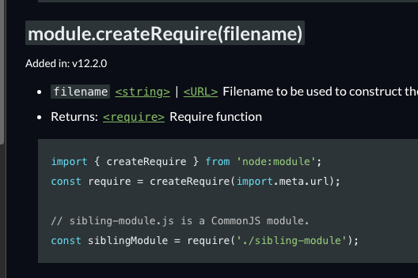

# ESM中使用CJS模块特有的变量和方法

## 前言
最近在看 VitePress 的源码时看到了一个`createRequire`方法，如下。

```ts
import { createRequire } from 'module'

const require = createRequire(import.meta.url)
const pkg = require('vitepress/package.json')
```

太妙了，ESM里居然可以通过这种方式创建require使用（是之前孤陋寡闻了），之前这种ESM和CJS混用的场景，都是通过构建工具处理的，也没有关心产物最后生成啥样。

下来翻了翻文档发现这个Node v12.2.0 就有了



结合最近开发 VitePress 主题需要ESM中获取 `__dirname` 的经验，这里就顺便记录一下。

*毕竟最近 [Vite 5](https://vitejs.dev/blog/announcing-vite5) 也出来了，也是推荐使用 ESM 模块*

## 先来个demo
创建一个`test.mjs`文件，内容如下

```js
console.log('__dirname', __dirname)
console.log('__filename', __filename)
console.log(require)
```
执行`node test.mjs`，你应该会得到如下类似的报错信息

```sh
file:///Users/sugar/Documents/fe/sugar-blog/test.mjs:1
console.log('__dirname', __dirname)
                         ^

ReferenceError: __dirname is not defined in ES module scope
    at file:///Users/sugar/Documents/fe/sugar-blog/test.mjs:1:26
    at ModuleJob.run (node:internal/modules/esm/module_job:192:25)

Node.js v20.2.0
```

针对 require 的报错，是下面这样的

```sh
ReferenceError: require is not defined in ES module scope, you can use import instead
```

**！ESM 模块中是无法直接使用CJS模块里提供的这些变量的**
## 如何正确获取
### `__dirname`和`__filename`
在 ESM 中可以通过`import.meta.url` 获取到类似 `__filename` 的值

```js
console.log(import.meta.url)
```
执行后你会得到如下结果

```sh
file:///Users/sugar/Documents/fe/sugar-blog/test.mjs
```

>*其中 [import.meta](https://developer.mozilla.org/zh-CN/docs/Web/JavaScript/Reference/Operators/import.meta) 是一个给 JavaScript 模块暴露特定上下文的元数据属性的对象。它包含了这个模块的信息，比如说这个模块的 URL*

此时我们可再通过`url`模块上的`fileURLToPath`方法将其转换为`__filename`的值

```js
import { fileURLToPath } from 'url'

const __filename = fileURLToPath(import.meta.url)

console.log('__filename', __filename)
// __filename /Users/sugar/Documents/fe/sugar-blog/test.mjs
```

有了`__filename`，我们就可以通过`path`模块的`dirname`方法获取到`__dirname`的值了

```js
import { dirname } from 'path'

const __dirname = dirname(__filename)

console.log('__dirname', __dirname)
// __dirname /Users/sugar/Documents/fe/sugar-blog
```

### require

这个就是文章开头部分使用`createRequire`的场景了，我们可以通过`createRequire`方法创建一个`require`方法，然后就可以愉快的使用`require`了。

```js
import { createRequire } from 'module'

const require = createRequire(import.meta.url)

console.log(require('./package.json').name)
```

### 完整代码
```js
import { fileURLToPath } from 'url'
import { dirname } from 'path'
import { createRequire } from 'module'

const __filename = fileURLToPath(import.meta.url)
const __dirname = dirname(__filename)

console.log('__filename', __filename)
console.log('__dirname', __dirname)

const require = createRequire(import.meta.url)
console.log('name', require('./package.json').name)
```

### 解决的实际问题
在编写 Vite 插件时，想动态注入一个 alias 规则，编译的产物分别有cjs和esm的，在源码中编写需要兼容这2个场景

于是就有了如下代码
```ts
function isESM() {
  return typeof __filename === 'undefined' || typeof __dirname === 'undefined'
}
function getDirname() {
  return isESM() ? path.dirname(fileURLToPath(import.meta.url)) : __dirname
}

const aliasSearchVueFile = `${getDirname()}/../src/Search.vue`

const resolveAlias = {
  './VPNavBarSearch.vue': aliasSearchVueFile,
}
```


## 总结

综上，在 ESM 中也是可以优雅的使用CJS里的`require`, `__dirname`, `__filename` 的

