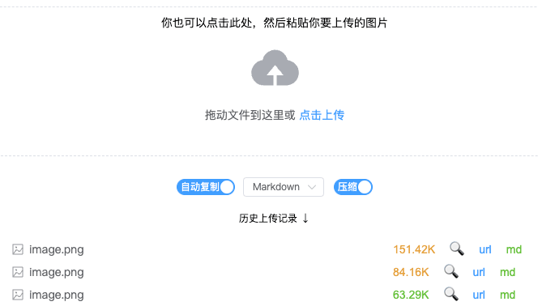

# 纯前端实现 PNG 图片压缩 | UPNG.js

>**在线 Demo 体验地址 →:** https://demos.sugarat.top/pages/png-compress/

## 前言
最近在迭代自己的 [图床](https://imgbed.sugarat.top/) 应用，由于使用时间的累计，存储空间占用越来越大了，在做 Web 应用的时候会随手拿 [tinypng](https://tinypng.com/) 压缩一下图片。

想着给咱图床也加个压缩的功能，这样上传/访问也能省点 💰。



图片类型众多，常用的主要就是`PNG/JPG/GIF`。

个人使用频率最高的场景是截图上传，格式为`PNG`，就先拿 `PNG` 试手。调研了一圈开源里最流行的就是使用 [UPNG.js](https://github.com/photopea/UPNG.js) 进行 PNG 的压缩。
* [官方对比 tinypng 介绍](https://blog.photopea.com/png-minifier-inside-photopea.html#examples)；
* [官方在线示例 Demo](http://upng.photopea.com/)。

## 如何判断图片是 PNG
第一步当然是判断图片类型，不然 `UPNG.js` 就不能正常工作咯，通过文件后缀 .png 判断肯定是不靠谱的。

搜索了解了一下，可以使用 `魔数` 判断：**一个PNG文件的前8个字节是固定的**。

`PNG` 的前 8 个字节是（16进制表示）：`89 50 4E 47 0D 0A 1A 0A`。

我们可以拿工具看一下，我这里用 VS Code 插件 [Hex Editor](https://marketplace.visualstudio.com/items?itemName=ms-vscode.hexeditor) 查看一个 PNG 图片的 16 进制表示信息。


可以看到前八个字节和上面表示的一样。

于是可以根据这个特性判断，于是就有如下的判断代码。

```ts
async function isPNG(file: File) {
  // 提取前8个字节
  const arraybuffer = await file.slice(0, 8).arrayBuffer()

  // PNG 的前8字节16进制表示
  const signature = [0x89, 0x50, 0x4E, 0x47, 0x0D, 0x0A, 0x1A, 0x0A]
  // const signature = [137, 80, 78, 71, 13, 10, 26, 10]

  // 转为 8位无符号整数数组 方便对比
  // https://developer.mozilla.org/zh-CN/docs/Web/JavaScript/Reference/Global_Objects/Uint8Array
  const source = new Uint8Array(arraybuffer)

  // 逐个字节对比
  for (let i = 0; i < signature.length; i++) {
    if (source[i] !== signature[i]) {
      return false
    }
  }
  return true
}
```

## UPNG.js

### 简介
>一个轻量且极速的 `PNG/APNG` 编码和解码库，[Photopea](https://www.photopea.com/) 图像编辑器的主要 `PNG` 引擎。

### npm 加载
官方提供了 `npm` 包，简单引入即可使用。

安装依赖
```sh
npm install upng-js
```

核心方法就 3 个，依次调用即可
* UPNG.decode(buffer)
* UPNG.toRGBA8(img)
* UPNG.encode(imgs, w, h, cnum, [dels])
  * cnum：0 表示无损压缩，256表示有损，可以调整这个值来控制压缩质量。

**注意：压缩并不意味着一定小，对于一些已经很简单且小的图片，压缩后可能反而更大。**

下面是这个方法的最简实现。
```ts
import UPNG from 'upng-js'

async function compressPNG(file: File) {
  const arrayBuffer = await file.arrayBuffer()
  const decoded = UPNG.decode(arrayBuffer)
  const rgba8 = UPNG.toRGBA8(decoded)

  // 关键的压缩方法
  // 这里 保持宽高不变，保持80%的质量（接近于 tinypng 的压缩效果）
  const compressed = UPNG.encode(
    rgba8,
    decoded.width,
    decoded.height,
    256 * 0.8
  )
  return new File([compressed], file.name, { type: 'image/png' })
}
```

其中压缩后的宽高，压缩质量都是可以调整的。

### 可配置封装
下面方法（TS 实现），提供了一些常用的配置选项。
```ts
import UPNG from 'upng-js'

interface CompressOptions {
  /**
   * 压缩质量（[0,1]）
   * @default 0.8
   */
  quality?: number
  /**
   * 压缩后更大是否使用原图
   * @default true
   */
  noCompressIfLarger?: boolean
  /**
   * 压缩后的新宽度
   * @default 原尺寸
   */
  width?: number
  /**
   * 压缩后新高度
   * @default 原尺寸
   */
  height?: number
}
async function compressPNGImage(file: File, ops: CompressOptions = {}) {
  const { width, height, quality = 0.8, noCompressIfLarger = true } = ops

  const arrayBuffer = await file.arrayBuffer()
  const decoded = UPNG.decode(arrayBuffer)
  const rgba8 = UPNG.toRGBA8(decoded)

  const compressed = UPNG.encode(
    rgba8,
    width || decoded.width,
    height || decoded.height,
    256 * quality
  )

  const newFile = new File([compressed], file.name, { type: 'image/png' })

  if (!noCompressIfLarger) {
    return newFile
  }

  return file.size > newFile.size ? newFile : file
}
```

### CDN 加载
不通过 npm 安装，也可以使用 `<script>` 标签的方式进行全局引入。

可以使用[Static file](https://www.staticfile.org/)提供的 CDN 资源。

只需在 HTML 模板顶部 head 中加入如下资源即可使用。
```html
<head>
  <script src="https://cdn.staticfile.net/pako/1.0.5/pako.min.js"></script>
  <script src="https://cdn.staticfile.net/upng-js/2.1.0/UPNG.min.js"></script>
</head>
```

PNG 格式化使用 `Inflate` 算法。这部分调用 [Pako.js](https://github.com/nodeca/pako) 实现，所以需要额外前置引入。

引入后，将在 window 上绑定 UPNG 变量，使用和上述 npm 给到的例子完全一致。

*代码里调用方式如下*
```js
window.UPNG.encode

// 省略 window
UPNG.encode
```

## 完整 demo
笔者将本节内容整理成了一个 Demo，可以直接在线体验。

>**在线 Demo 体验地址 →:** https://demos.sugarat.top/pages/png-compress/

大概界面如下：


*纯血 HTML/CSS/JS，复制粘贴就能运行。*

完整源码见：[GitHub:ATQQ/demos - png-compress](https://github.com/ATQQ/demos/tree/main/pages/png-compress)

## 最后
后续将继续学习&探索一下其它格式的**纯前端压缩实现**（JPG，GIF，MP4转GIF）。
