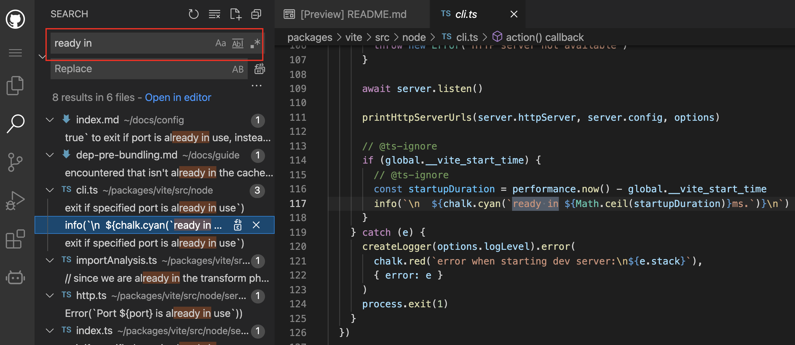

# Vite插件开发纪实：vite-plugin-monitor（中）

## 前言
[上一篇](./vite-plugin-monitor1.md)文章主要介绍了开发插件所需的准备工作，以及此次要开发的插件将要解决的问题

## 功能开发
有了前文的铺垫内容，下面就是功能开发

### 获取启动耗时
项目启动后会在终端中输出`ready in xxms`


为此咱们使用Vs Code在[源码](https://github1s.com/vitejs/vite)中搜一下这个关键字



可以看到此部分代码在源码中如下

```ts
const info = server.config.logger.info

// @ts-ignore
if (global.__vite_start_time) {
  // @ts-ignore
  const startupDuration = performance.now() - global.__vite_start_time
  info(`\n  ${chalk.cyan(`ready in ${Math.ceil(startupDuration)}ms.`)}\n`)
}
```
这个`performance.now()`等同于`Date.now()`即当前时间，通过`global.__vite_start_time`就能获取到服务启动时间

我们就从这个`info`方法入手，给它重定义一下，通过`configureServer`钩子可以获取到server实例

**index.ts**
```ts
import type { Plugin } from 'vite';

export default function Monitor(): Plugin {
  const startTime = global.__vite_start_time

  return {
    name: 'vite-plugin-monitor',
    apply: 'serve',
    configureServer(server) {
      const { info } = server.config.logger;
      // 拦截info方法的调用
      server.config.logger.info = function _info(str) {
        // 调用原info方法
        info.apply(this, arguments);
        // 通过字符串内容进行一个简单的判断
        if (str.includes('ready in')) {
          console.log('startupDuration', Date.now() - startTime)
        }
      };
    },
  };
}
```

启动一个项目看看效果，成了。


### HMR时间获取
热更新时，终端中会出现下面的日志


同理源码里搜一搜，能够定位出如下内容
```ts
config.logger.info(
    updates
    .map(({ path }) => chalk.green(`hmr update `) + chalk.dim(path))
    .join('\n'),
  { clear: true, timestamp: true }
)
```
暂以打印这个日志的时间作为HMR开始的时间

```ts
let startTime = null
const { info } = server.config.logger;
server.config.logger.info = function _info(str) {
  info.apply(this, arguments);
  if (str.indexOf('hmr update') >= 0) {
    startTime = Date.now()
  }
};
```


触发HMR时，客户端会发出一个获取资源的请求，请求携带了一个import参数，我们通过这个参数来标识这个特定的请求
```sh
http://localhost:8080/src/pages/home/index.vue?import&t=1632924377207
```
钩子中的server实例包含`middlewares`属性可以向上添加自定义的中间件处理方法
* 通过URL实例解析`search`参数，然后判断是否包含`import&`
* 重定义`end`方法，在资源传回到客户端后打印耗时

```ts
server.middlewares.use(async (req, res, next) => {
  const { search } = new URL(req.url, `http://${req.headers.host}`);
  if (
    search.indexOf('import&') >= 0
  ) {
    const { end } = res;
    res.end = function _end() {
      // 在资源返回后打印耗时
      end.apply(this, arguments);
      console.log(Date.now() - startTime)
    };
  }
  next();
});
```

事实上通过`--debug`启动服务，能看到在HMR时会打印4个时间


目前方法仅仅得到了`vite:hmr`部分的时间，与实际耗时还有一丝丝差异

## 小结
更加详细的信息只能通过`--debug`看到，下一步的计划就是hack，模拟一下debug下的行为，将debug的打印的数据都拦截下来
由于时间关系，这部分hack还没完成。准备假期抽时间实现一下。下一篇文章将详细的介绍最终实现。

