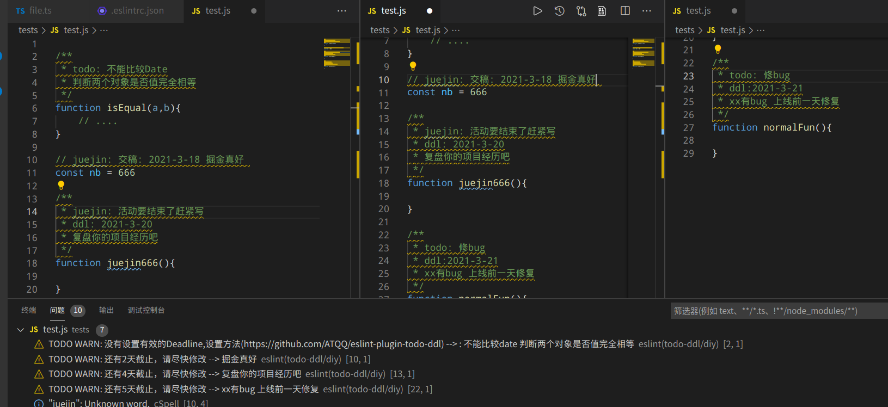

# 一款检测代码中TODO的eslint插件

## 前言
看了我标题进来的同学应该也知道我做的是个啥东西

没错是一个[eslint](https://eslint.org/)插件,前端魔法师们日常所使用的工具之一

什么?你不知道eslint是干嘛的--吃鲸.jpg
* ESLint 是一个开源的 JavaScript 代码检查工具
* 能在多人协作项目中帮助统一代码风格

**百闻不如[一见](https://github.com/ATQQ/eslint-plugin-todo-ddl)**,先带大家看看[插件](https://github.com/ATQQ/eslint-plugin-todo-ddl)效果




因为在工作中临时会插入许多其它的事,或者有些代码,接口是有时效性的需要手动下线

插件功能简单讲就是为不完善的代码**做标记**,提醒自己如期修改完善bug


想亲自尝试一下的同学戳[这里](https://github.com/ATQQ/eslint-plugin-todo-ddl)---顺手Star

下面开始介绍为什么会写这个插件,以及过程中遇到的问题,和插件的一些核心方法

## 背景

前端魔法师们,经常不经意间就会在代码中下毒,坑害同事,甚至直接使"线上爆炸"

当时遇到一个线上问题就是如此:
* 一个有实效性的活动入口,需要到点下线,一个需要常驻的活动入口,不需要下线
* 由于实效性活动下线时间还有大半年

coder为了图方便,直接把实效性活动业务组件拿着复用,想着到时候改,反正时间还长

半年后的一天,客述就来了,说xx入口怎么不见了,彼时开发此页面的同事已经调走,目前的项目组基本都是后来的

第一反应是不是昨晚提交了什么代码,把入口**吓掉了**,然后就开始翻发布记录,发现并没有发版,就奇怪了,好好地怎么就不见了

然后同事们就开始排查代码了,不一会儿就发现了问题所在,然后快速的改掉上线,避免影响扩大


## 事后复盘
* Leader: 咱能不能用啥工具避免此类问题发生
* 菜鸡: 阿巴阿巴一堆话
* Leader: 那行你说了这么多,这个任务就交给你了,下周给个方案
* 菜鸡: ...哦豁,要被卷铺盖走人了

## 个人思考
在不完善的代码或有时效性的代码处搞一个flag,通过工具检测这个flag然后提醒此项目的所有开发者

开发者打开这个项目就能知道xx flag处有隐患

## 调研-可行方案
### cli工具
项目启动后,跑一个npm script

扫描目标文件,然后通过正则匹配flag关键字基于提示

### vs code插件
前端魔法师基本都用的Vs Code

项目启动后,自动扫描目标文件

通过正则匹配flag,然后基于提示

这个有现成的[todo-tree](https://github.com/Gruntfuggly/todo-tree)

### eslint规则
前端项目都会引入eslint 来统一团队成员的编码风格

只要编写一个自定义的规则,通过分析eslint 提供的AST,就能轻易的拿到标记的flag

### 对比
|    方案     |                          优点                           |                        缺点                         | 学习成本 |
| :---------: | :-----------------------------------------------------: | :-------------------------------------------------: | :------: |
|   cli工具   |     不限制语言/文件类型,通过正则就能进行轻易的匹配      | 需要为每个项目单独编写一个指令,通过hook或者人工触发 |   ❤❤❤    |
| vs code插件 | 只需要用户为编辑器安装一个插件,即可在打开的时候进行提示 |  魔法师们可能用sublime/webStorm  ,需要重复开发插件  |   ❤❤❤❤   |
| eslint规则  | 只需要在项目的配置文件中加入一行规则代码,即可实时的提示 |            需要安装依赖,首次需要手动引入            |    ❤❤    |


### 最终选择
基于eslint编写一个eslint-plugin来实现自定义校验规则

**原因**
* 前端项目都会引入eslint
* 不限制编辑器
* 理论上不限制前端开发常用的语言/框架的检测
* 标准化团队统一了所有仓库的lint规则,只需在标准化规则中加入即可
  * 其余仓库,只要执行依赖安装(yarn/npm i) 就会将最新的规则引入项目,使用者能0配置接入


## 实现过程
下面会展开介绍插件的实现原理,会涉及到一些代码的展示

首先eslint会将响应的文件用AST描述出来,并且提供了一些简单的API进行操作
```js
create(context) {
    // 取得AST
    const sourceCode = context.getSourceCode()
    // 获取所有的注释节点
    let comments = sourceCode.getAllComments()
}
```

注释节点有两种
```js
// 注释
/**
 * Block
 **/
```

从注释节点中过滤出以flag关键字开始的注释节点
```js
// 过滤出包含关键词的注释节点
comments = comments.filter(comment => {
    let { value, type } = comment
    // 展平块状注释
    if (type === 'Block') {
        value = value.replace(/\*|\n/g, '')
    }
    value = value.toLowerCase().trim()
    // 保存格式化后的字符串
    comment.newValue = value
    for (const flag of dFlag) {
        // 检测是否一关键字开头
        if (value.startsWith(flag)) {
            // 保存上flag
            comment.flag = flag
            return true
        }
    }
    return false
})
```

此时过滤后的注释基本格式如下
```js
// flag ddl:time  xxxxx
```
接下来从中解析出**ddl**和提示信息

首先ddl也是一个可配置的关键字

需要检测的日期格式如下
|  format1   |    demo    |  format2   |    demo    | format3  |   demo   |
| :--------: | :--------: | :--------: | :--------: | :------: | :------: |
| yyyy-mm-dd | 2020-06-01 | yyyy/mm/dd | 2020/06/01 | yyyymmdd | 20200601 |
|            | 2020-06-1  |            | 2020/06/1  |          |  200601  |
|            | 2020-6-01  |            | 2020/6/01  |
|            |  20-06-01  |            |  20/06/01  |
|            |   20-6-1   |            |   20/6/1   |
|            |  20-6-01   |            |  20/6/01   |

所以代码中做了许多判断
* 代码可能有点shi,看官们可以给点建议优化下
```js
// 匹配日期的正则
const rDate = [{
    reg: /((\d{4})|(\d{2}))(-((0\d)|(\d{2})|(\d{1}))){2}/,
    flag: '-' // yyyy-mm-dd|yy-mm-dd
},
{
    reg: /((\d{4})|(\d{2}))(\/((0\d)|(\d{2})|(\d{1}))){2}/,
    flag: '/'// yyyy/mm/dd|yy/mm/dd
},
{
    reg: /(\d{8})|(\d{6})/,
    flag: 'number'// yyyymmdd|yymmdd
}]
/**
 * 获取TODO注释中的DDL,是则返回日期值及其todo内容
 * @param {String} value 待操作字符串
 * @param {String[]} ddlSymbol 截止时间标识符
 * @param {STring} todoSymbol
 * @return {Object}
 */
function getDDLAndText(value, ddlSymbol, todoSymbol) {
    let text = value.slice(value.indexOf(ddlSymbol) + ddlSymbol.length),
        date = ''
    for (const rdate of rDate) {
        const { reg, flag } = rdate
        const res = text.match(reg)
        if (res) {
            const [dateStr] = res
            // 再次校验匹配的日期日期是否合法
            if (reg.test(dateStr)) {
                let year, month, day
                if (flag !== 'number') {
                    let ymd = dateStr.split(flag)
                    ymd = ymd.map(v => {
                        return v.length === 1 ? `0${v}` : v
                    })
                    year = ymd[0]
                    month = ymd[1]
                    day = ymd[2]
                } else {
                    const { length } = dateStr
                    day = dateStr.slice(length - 2)
                    month = dateStr.slice(length - 4, length - 2)
                    year = dateStr.slice(0, length - 4)
                }
                if (year.length === 2) {
                    year = new Date().getFullYear().toString().slice(0, 2) + year
                }
                text = text.slice(text.indexOf(dateStr) + dateStr.length)
                date = `${year}-${month}-${day}`
                // 日期不合格也pass掉
                if (month > 12 || day > 31) {
                    date = ''
                }
                break
            }
        }
    }
    return {
        text,
        date
    }
}
```

这样就拿到了flag的**截止日期**与**内容**

接下来只需要根据设置的时间警戒线进行提示即可

```js
// 未设置DDL或者DDL不合法情况
if (!date) {
    errMsg = '没有设置有效的Deadline,设置方法(https://github.com/ATQQ/eslint-plugin-todo-ddl)'
} else {
    const TODODate = new Date(date).getTime()
    const interval = TODODate - Date.now()
    // 如果已经到期
    if (interval < 0 || interval < oneDay) {
        errMsg = '已经过截止日期，请立即修改'
    } else {
        // 剩余天数(向下取整)
        const theRestDays = ~~(interval / oneDay)
        errMsg = theRestDays <= dWarnLine ? `还有${theRestDays}天截止，请尽快修改` : ''
    }
}
if (errMsg) {
    context.report({
        node: comment,
        message: `TODO WARN: ${errMsg} --> ${text}`
    })
}
```

到此就大工搞成了,可以发包上线了

## 总结思考
### 不足之处
1. 代码还有可改进之处
2. 插件上线后并没大改过,功能感觉还可以增强,需要朋友们多给点意见

### 收获
1. leader还是评价不错,毕竟那时候实习生身份刚入职几天
2. 自己也有所提升,对eslint的工作原理有了新的认识
3. 也为团队日后各种花式校验规则提供了技术积累

### 未来
1. 找时间根据反馈,迭代一下插件,提高其可玩性


## 其它
* [eslint插件开发教程文档](./../learn/eslint-plugin.md)
* [vs code插件 todo-tree](https://github.com/Gruntfuggly/todo-tree)也很棒哟

>[本文](https://juejin.cn/post/6939877553582637069)正在参与「掘金 2021 春招闯关活动」, 点击查看 [活动详情](https://juejin.cn/post/6939329638506168334)

