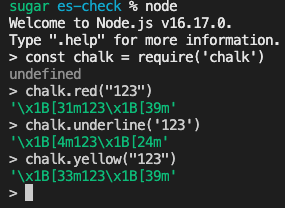
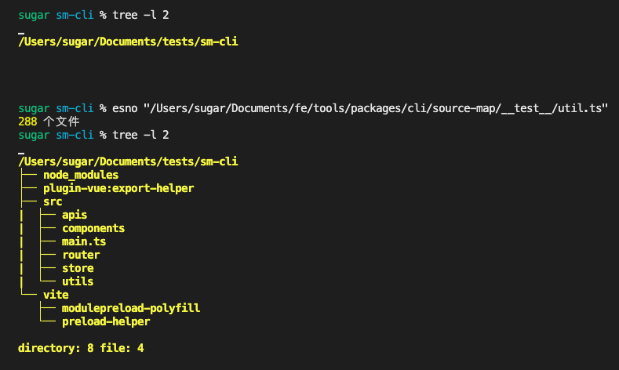
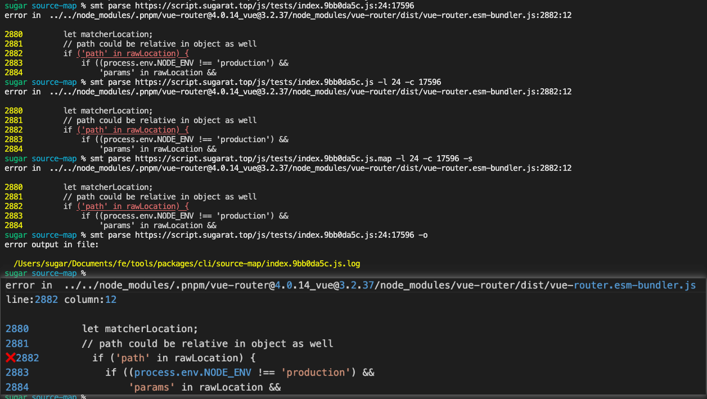

# SourceMap解析CLI工具实现

> 本文为稀土掘金技术社区首发签约文章，14天内禁止转载，14天后未获授权禁止转载，侵权必究！

## 前言

**source-map** 大家都不陌生了，通常情况就是产物里的`xx.js.map`文件里的内容。

可用于对压缩混淆后的代码还原。通常用于帮助定位源码问题。

区别于构建时的配置（[以webpack 的devtool配置项为例](https://webpack.docschina.org/configuration/devtool/#special-cases)）不同配置，`source-map`暴露的信息程度也就也不一样

一般公司里的项目，是会把`.map`文件上传到内网环境，不耽误问题排查，也不暴露源码

个人的开源项目，一般就没这么讲究了，直接和产物一起传了。

前端监控平台，一般都支持错误堆栈解析，通过`.map`，还原出错代码位置调用堆栈信息。

有时候没有自动解析的平台可用的时候（比如一些商用监控平台，免费版通常不提供自动source-map解析能力）

就会搜些在线`source-map`解析工具凑合一下，包含在线网页，以及CLI版本的。作者也体验使用了一些（都贴到最后附录列表中，读者有其它推荐的也可评论区补充）。

本文将综合现有的source-map cli解析工具优缺点，取长补短，🐴一个缝合怪（主要包含`报错源码解析`和`根据sourceMap文件生成源码`2个能力）。

先上个演示，有兴趣的读者可接着往下看
```sh
npm i -g @sugarat/source-map-cli
```


## source-map库的简介
npm地址：[source-map](https://www.npmjs.com/package/source-map)

可以用于生成和解析sourcemap的库，本文主要用到其解析的能力，关注[API:SourceMapConsumer](https://www.npmjs.com/package/source-map#sourcemapconsumer)即可

下面是示例，其返回值`consumer`是一个`Promise`
```ts {4}
import sourceMap from 'source-map'

function createSourceMapConsumer(sourceMapCode: string) {
  const consumer = new sourceMap.SourceMapConsumer(sourceMapCode)
  return consumer
}
```

`consumer`中包含一个`sources`属性，标明了包含的所用到的源码文件路径信息，通过实例上的`sourceContentFor`方法即可获取到对应`文件(source)`的`源码(sourceCode)`
```ts
// mapContent 内容来源 https://script.sugarat.top/js/tests/index.9bb0da5c.js.map
;(async () => {
  const consumer = await createSourceMapConsumer(mapContent)

  // [
  // '../../vite/modulepreload-polyfill',
  // '../../node_modules/.pnpm/@vue+shared@3.2.37/node_modules/@vue/shared/dist/shared.esm-bundler.js',
  // 类似的源文件路径
  // ]
  const sourceFileNames = consumer.sources

  // 源文件个数
  const sourceCount = sourceFileNames.length

  // 第一个源文件的内容
  const sourceCode = consumer.sourceContentFor(sourceFileNames[0])
})()
```

`consumer`实例上的另一个最常用的方法`originalPositionFor`可以通过压缩混淆后的代码行列号，解析出源文件信息。

包含`源文件source`,`行号line`,`列号column`,`name`
```ts
// 第一个源文件的内容
const sourceCode = consumer.sourceContentFor(sourceFileNames[0])

// 通过压缩混淆后的代码的行列号，定位到源文件
const sourceInfo = consumer.originalPositionFor({
  line: 24,
  column: 17596
})

// 这个例子的结果如下
console.log(sourceInfo)
//   {
//     source: '../../node_modules/.pnpm/vue-router@4.0.14_vue@3.2.37/node_modules/vue-router/dist/vue-router.esm-bundler.js',
//     line: 2882,
//     column: 12,
//     name: null
//   }
```
通过如上2个简单的`API`即可完成常用能力的封装。

本小节[示例代码](https://github.com/ATQQ/tools/blob/main/packages/cli/source-map/__test__/sourcemap.ts)
## .map资源加载
通常每个js产物都对应有一份`.map`文件，文件命名为`原文件名.js.map`

在不考虑特殊的约定条件情况下，通常情况是在js产物末尾都有1个`// #sourceMappingURL=xx.js.map`注释表明js资源关联的map文件路径

于是乎咱们，可以先写个方法来获取传入文件对应的sourceMap文件路径

### 本地sourceMap路径获取
先是考虑本地的情况，通过路径拼接`.map`与读取文件文件末尾`sourceMappingURL`2种方式相结合

```ts
function getLocalSourceMapFilePath(sourceJsPath: string) {
  // 文件不存在
  if (!existsSync(sourceJsPath)) {
    return NOT_FOUND
  }

  // 先直接判断是否存在.js.map文件存在
  if (existsSync(`${sourceJsPath}.map`)) {
    return `${sourceJsPath}.map`
  }

  // 获取代码里的 // #sourceMappingURL= 注释的内容
  const jsCode = readFileSync(sourceJsPath, 'utf-8')
  const flag = '//# sourceMappingURL='
  const flagIdx = jsCode.lastIndexOf(flag)
  if (flagIdx === -1) {
    return NOT_FOUND
  }
  const sourceMappingURL = jsCode.slice(flagIdx + flag.length)

  // 如果是http路径表明 是绝对路径 直接返回
  if (isHTTPSource(sourceMappingURL)) {
    return sourceMappingURL
  }

  // 否则拼接js资源的目录
  return path.resolve(path.dirname(sourceJsPath), sourceMappingURL)
}
```
本小节[示例代码](https://github.com/ATQQ/tools/blob/9cee3f881157199c365b0a41ababe31d2f5b6fdf/packages/cli/source-map/src/util/index.ts#L26)

### 远程资源加载
除了本地情况那也有线上资源的情况，比如用于测试的`https://script.sugarat.top/js/tests/index.9bb0da5c.js`

下面介绍3种常见方式获取`http`资源，`http`,`axios`,`fetch`

首先是`http`，node内置网络模块，使用上的感官和web里的[XMLHttpRequest](https://developer.mozilla.org/zh-CN/docs/Web/API/XMLHttpRequest)差不多，不太优雅

简单场景书写代码量也在可接受的范围
```ts
import http from 'http'
import https from 'https'

function getRemoteSource(
  url: string
): Promise<{ body: string; code?: number }> {
  return new Promise((resolve, reject) => {
    // 区别https与http资源
    const HTTP = url.startsWith('https://') ? https : http

    // 通过回调的形式获取
    HTTP.get(url, (res) => {
      // 设置可读流的字符编码
      res.setEncoding('utf-8')

      // 响应内容拼接
      let content = ''
      res.on('data', (chunk) => {
        content += chunk
      })

      // 读完对外暴露内容和状态码
      res.on('end', () => {
        resolve({
          body: content,
          code: res.statusCode
        })
      })

      res.on('error', (err) => {
        reject(err)
      })
    })
  })
}
```

`axios`，前端常用的跨平台网络请求库（web/node/其它场景提供adaptor层做适配）

用这个代码量就更简洁了，3行就能搞定
```ts
function getRemoteSourceByAxios(url: string) {
  return axios.get(url).then((v) => {
    return {
      code: v.status,
      body: v.data
    }
  })
}
```


`fetch`，在web侧已经出现很久了，Node.js>=v17.5.0 内置，低版本可使用第三方的[node-fetch](https://www.npmjs.com/package/node-fetch)

这里使用`node-fetch`进行举例，使用也是非常简单
```ts
import fetch from 'node-fetch'

function getRemoteSourceByFetch(url: string) {
  return fetch(url).then(async (v) => {
    const code = v.status
    const body = await v.text()
    return {
      code,
      body
    }
  })
}
```

包含但不限于以上三种方式达到需要的目的。本小节[示例代码](https://github.com/ATQQ/tools/blob/main/packages/cli/source-map/__test__/remoteSource.ts)

### 远程sourceMap路径获取
思路和本地的资源逻辑基本一致，只是内容获取和判断需要走网络，实现如下，接近一半都是重复代码，有优化空间，这里不赘述了
```ts
async function getRemoteSourceMapFilePath(sourceJsPath: string) {
  const context = await getRemoteSource(sourceJsPath)
  if (context.code === 404) {
    return NOT_FOUND
  }
  if ((await getRemoteSource(`${sourceJsPath}.map`)).code === 200) {
    return `${sourceJsPath}.map`
  }
  const jsCode = context.body
  const flag = '//# sourceMappingURL='
  const flagIdx = jsCode.lastIndexOf(flag)
  if (flagIdx === -1) {
    return NOT_FOUND
  }
  const sourceMappingURL = jsCode.slice(flagIdx + flag.length)
  if (isHTTPSource(sourceMappingURL)) {
    return sourceMappingURL
  }
  return path.resolve(path.dirname(sourceJsPath), sourceMappingURL)
}
```

简单做合并后的方法如下
```ts
const isHTTPSource = (sourcePath: string) =>
  sourcePath.startsWith('http')

async function getSourceMapFilePath(sourceJsPath: string) {
  if (!isHTTPSource(sourceJsPath)) {
    return getLocalSourceMapFilePath(sourceJsPath)
  }
  return getRemoteSourceMapFilePath(sourceJsPath)
}
```

本小节[示例代码](https://github.com/ATQQ/tools/blob/9cee3f881157199c365b0a41ababe31d2f5b6fdf/packages/cli/source-map/src/util/index.ts#L19)

## 还原报错源码
有了前面的基础，咱们第一个整合功能就可以实现了 **根据报错资源信息，还原源码和行列号**，先给出方法的定义

```ts
interface SourceResult {
  /**
   * 源码
   */
  sourceCode: string
  /**
   * 源码文件路径
   */
  source: string
  /**
   * 行号
   */
  line: number
  /**
   * 列号
   */
  column: number
}

/**
 * 根据报错资源信息，获取对应源码信息
 * @param url 报错资源
 * @param line 行号
 * @param column 列号
 */
async function getErrorSourceResult(
  url: string,
  line: number,
  column: number
): Promise<SourceResult>
```

利用上面实现的`getSourceMapFilePath`,配合`source-map`的2个API即可实现`originalPositionFor`,`sourceContentFor`
```ts
import fs from 'fs/promises'

const sourceMapURL = await getSourceMapFilePath(url)

// sourceMap 内容
const sourceMapCode = await (isHTTPSource(sourceMapURL)
  ? getRemoteSource(sourceMapURL).then((v) => v.body)
  : fs.readFile(sourceMapURL, 'utf-8'))

const consumer = await createSourceMapConsumer(sourceMapCode)
// 解析出原来的行列号，源文件路径等信息
const { name, ...rest } = consumer.originalPositionFor({
  line,
  column
})
// 获取源码
const sourceCode = consumer.sourceContentFor(rest.source!)
const result = {
  ...rest,
  sourceCode
}
```
方便终端里预览结果，可以编写一个`printSourceResult`方法，友好的打印输出一些内容
```ts
getErrorSourceResult(
  'https://script.sugarat.top/js/tests/index.9bb0da5c.js',
  24,
  17596
).then(printResult)
```
示例打印结果如下


方法实现如下(详细释义见注释)

```ts
/**
 * @param result
 * @param showMaxLine 控制显示的行数
 */
export function printResult(result: SourceResult, showMaxLine = 5) {
  const { sourceCode, source, line, column } = result
  // 源码拆成数租
  const lines = sourceCode.split('\n')

  // 打印错误路径
  console.log(`error in  ${source}:${line}:${column}`)
  console.log()

  // 计算要展示的行的起始位置，起始行号不能小于1
  const startLine = Math.max(1, line - Math.floor(showMaxLine / 2))
  // 结束位置不能大于总行数
  const endLine = Math.min(lines.length, startLine + showMaxLine - 1)

  const showCode = lines
    // 截取需要展示的内容
    .slice(startLine - 1, endLine)
    .map(
      (v, idx) =>
        // 加上黄色行号
        `${yellowStr(startLine + idx)} ${
          // 针对错误的行进行下划线+红色展示
          idx + startLine === line
            ? // 从错误的列号开始展示
              v.slice(0, column - 1) + redStr(underlineStr(v.slice(column - 1)))
            : v
        }`
    )
    .join('\n')

  console.log(showCode)
}
```
打印彩色的场景有限，这里直接将需要的效果颜色对应的`ANSI Escape code`从`chalk`库中截取出来



```ts
const underlineStr = (v: any) => `\x1B[4m${v}\x1B[24m`

const yellowStr = (v: any) => `\x1B[33m${v}\x1B[39m`

const redStr = (v: any) => `\x1B[31m${v}\x1B[39m`
```

到此第一个功能的核心代码就封装好了

本小节[示例代码](https://github.com/ATQQ/tools/blob/9cee3f881157199c365b0a41ababe31d2f5b6fdf/packages/cli/source-map/__test__/util.ts#L15-L27)

## 完整source生成
都知道通过`sourceMap`可以获取完整的源码，所以一般的非开源应用，都是对`sourceMap`文件做了环境隔离，防止源码泄露。

这部分就封装1个方法，**实现将sourceMap中包含的所有源文件输出到本地指定目录**

首先实现1个方法，将sourceMap中需要的信息解析出来
```ts
export async function getSourcesBySourceMapCode(sourceMapCode: string) {
  const consumer = await createSourceMapConsumer(sourceMapCode)
  const { sources } = consumer
  const result = sources.map((source) => {
    return {
      source,
      code: consumer.sourceContentFor(source)
    }
  })
  return result
}
```

配合文件操作(`fs`模块)，将内容输出到文件系统
```ts
import { existsSync, mkdirSync, writeFileSync } from 'fs'

async function outPutSources(
  sources: SourceItem[],
  outPutDir = 'source-map-result/project'
) {
  for (const sourceItem of sources) {
    const { source, code } = sourceItem
    const filepath = path.resolve(process.cwd(), outPutDir, source)
    if (!existsSync(path.dirname(filepath))) {
      mkdirSync(path.dirname(filepath), { recursive: true })
    }
    writeFileSync(filepath, code, 'utf-8')
  }
}
```

示例代码与运行结果如下
```ts
getRemoteSource(
  'https://script.sugarat.top/js/tests/index.9bb0da5c.js.map'
).then(async ({ body }) => {
  const sources = await getSourcesBySourceMapCode(body)
  console.log(sources.length, '个文件')
  outPutSources(sources)
})
```



本小节[示例代码](https://github.com/ATQQ/tools/blob/9cee3f881157199c365b0a41ababe31d2f5b6fdf/packages/cli/source-map/__test__/util.ts#L30-L36)

到此常用的2个能力的核心实现就完成了，下面将把其封装为一个CLI工具，方便接入使用

## 封装CLI
基于`commander`进行实践
### parse指令
首先是指令的定义

主要功能就是将指定的 `error js` 资源的通过`sourcemap`还原出具体的报错源码

```ts
program
  // sourceUrl 格式 <url>[:line][:column]
  .command('parse <sourceUrl>')
  .description('parse error form url source')
  .alias('p')
  // 标明sourceUrl 是否为 sourceMap 资源
  .option('-s, --source-map', 'set url source as sourceMap type')
  // 单独设置行号
  .option('-l, --line <number>', 'set line number')
  // 单独设置列号
  .option('-c, --column <number>', 'set column number')
  // 将结果输出到文件
  .option('-o, --output [string]', 'set log output dir')
  // 设置展示的错误信息行数
  .option('-n, --show-num <number>', 'set show error source lines', '5')
  .action(parseCommand)
```

为保证下面3个指令一样的效果，需要对 **\<sourceUrl\>** 与 `-c`,`-l` **Option**做一层处理
```sh
smt parse xxx.js:24:17596
smt parse xxx.js -l 24 -c 17596
smt parse xxx.js:24 -c 17596
```

```ts
const match = sourceUrl.match(/:\d+/)
let url = sourceUrl
let l
let c
if (match?.index) {
  ;[l, c] = sourceUrl.slice(match.index + 1).split(':')
  url = sourceUrl.slice(0, match.index)
}
// 最终需要的行号和列号
const line = l || options.line
const column = c || options.column
```

后续的处理逻辑只需要把`url`,`line`,`column`3个参数传给前面实现的`getErrorSourceResult`方法即可

效果如下



本小节[源码](https://github.com/ATQQ/tools/blob/main/packages/cli/source-map/src/command/parse.ts)
### sources指令
sources指令定义
```ts
program
  .command('sources <sourceUrl>')
  .description('generating source files by source-map')
  .alias('s')
  .option('-s, --source-map', 'set url source as sourceMap type')
  .option('-o, --output [string]', 'set log output dir')
  .action(sourcesCommand)
```

效果如下


本小节[源码](https://github.com/ATQQ/tools/blob/main/packages/cli/source-map/src/command/sources.ts)

## 最后
这个CLI本身能力比较简单，依赖的核心库也只有`source-map`。主要用于弥补缺失平台自动解析source-map能力的场景，协助定位`js error`的报错源码

后续再出一篇在线sourcemap解析的工具，功能与CLI类似，不过是Web版的

CLI完整源码见[GitHub](https://github.com/ATQQ/tools/tree/main/packages/cli/source-map)

## 附录
其它同类 Web&CLI 工具

Web
* [decodeSourceMap](https://www.hai-fe.com/decodeSourceMap)

CLI
* [restore-source-tree](https://www.npmjs.com/package/restore-source-tree)
* [source-map-tools](https://www.npmjs.com/package/source-map-tools)
* [source-map-cli](https://www.npmjs.com/package/source-map-cli)
* [source-map-to-source](https://www.npmjs.com/package/source-map-to-source)
* [kaifu](https://www.npmjs.com/package/kaifu)
* [@hl-cli/restore-code](https://www.npmjs.com/package/@hl-cli/restore-code)

