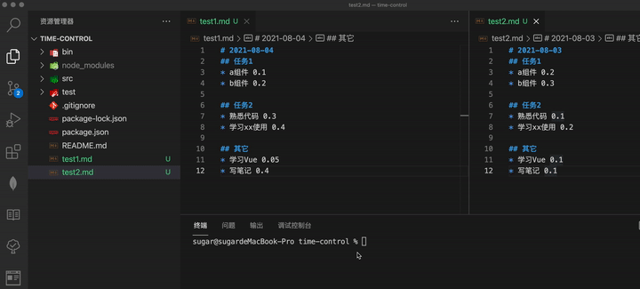

# 做一个CLI版的时间管理工具（三）

## 前言
[上一篇文章](./time-tools-2.md)完成了**markdown转JSON**的逻辑与 **自定义指令的添加**介绍

本文将详细讲解一些 从输入指令`timec -oj filepath1 filepath2 ....` 到正确执行的逻辑

## 功能开发
### 批量MD转JSON详细逻辑
将传入的相对路径转绝对路径
* 其中`process.cwd()`标识命令的执行目录
```js
const path = require('path')
// 首先获得命令执行目录
const cwd = process.cwd()

// 将传入的相对文件路径批量转为绝对路径
filenames = filenames.map(f=>{
  return path.join(cwd,f)
})
```

批量获取多个文件的内容:
* 使用`fs.readFileSync`获取单个文件的内容
* 利用`Array.prototype.reduce`合并多个文件的内容，以`\n`分割
```js
const fs = require('fs')

/**
 * 获取文件内容
 * @param {string} filepath
 */
function getFileContent(filepath) {
    return fs.readFileSync(filepath, { encoding: 'utf-8' })
}
/**
 * 获取多个文件的内容
 * @param {string[]} files
 */
function getFilesContent(files) {
    return files.reduce((pre, now) => {
        pre += '\n'
        pre += getFileContent(now)
        return pre
    }, '')
}
```
将MD转为JSON并输出到文件：
* 转为JSON的详细逻辑看上一篇文章的介绍
* 创建文件时需判断原文件是否已存在，存在则使用新的名称，避免覆盖内容

```js
// 获取所有文件的内容
const content = getFilesContent(filenames)

let outFileName = 'res'
// 转为JSON对象，并执行JSON.stringify
createFile(path.join(cwd, `${outFileName}.json`), outputJson(content), false)

// ------------------------------------------------
function outputJson(content) {
    return JSON.stringify(getJSON(content))
}

/**
 * 创建一个新文件
 * @param {string} path
 * @param {string} content
 * @param {boolean} judgeRepeat
 */
function createFile(path, content, judgeRepeat = true) {
    if (!fs.existsSync(path)) {
        fs.writeFileSync(path, content, { encoding: 'utf-8' })
        return true
    }
    if (judgeRepeat) {
        console.error(`${path} 已存在`);
        return false
    }
    fs.writeFileSync(getNoRepeatFilePath(path), content, { encoding: 'utf-8' })
    return true
}
```
根据已存在的路径，生成一个新的路径逻辑如下
* 往文件名末尾添加一个自增的数字
  * 通过`path.parse`方法解析路径 （/user/home/abc.txt）
    * dir：目录 （/user/home）
    * name：文件名 （abc）
    * ext：文件后缀 （.txt）
* 如果数字存在则自增这个数字，直至数字不存在

```js
/**
 * 获取与原文件不重复的一个文件路经
 * @param {string} originPath
 */
function getNoRepeatFilePath(originPath) {
    let num = 1
    const { dir, name, ext } = path.parse(originPath)
    if (!fs.existsSync(originPath)) {
        return originPath
    }
    while (fs.existsSync(getFilePath(dir, `${name}-${num}${ext}`))) {
        num += 1
    }
    return getFilePath(dir, `${name}-${num}${ext}`)
}
```

到此从 `MD读取` -> `转换为JSON` -> `写出到文件` 流程都拆解阐述完毕

### 合并MD记录并按时间排序
咱们再给它添加一个`--markdown`options用与后续的合并多个markdown逻辑

```js
commander.arguments('<filenames...>') // 多个文件/目录
    .option('-m, --markdown', 'Export the result as a markdown file')
    .action((filenames, cmdObj) => {
        const { output,markdown } = cmdObj

        // 导出
        if (output) {
            let outFileName = 'res'
            // 获取所有文件的内容（同上）
            const content = getFilesContent(filenames.map(filename => {
                return getFilePath(cwd, filename)
            }))
            if (markdown) {
                createFile(getFilePath(cwd, `${outFileName}.md`), outPutMarkdown(getJSON(content),time), false)
            }
        }
    })
```
代码涉及到的其它函前面些文章已经做了详细介绍

下面围绕`outPutMarkdown`逻辑展开:
* 先获取所有md文件的内容，再调用`getJSON`方法转为JSON对象
* 调用`sort`方法对title（时间）进行排序
* 将排序后的json对象，调用`getEverydayData`详细转换每一天的数据

```js
function outPutMarkdown(jsonSchema,withTime = false) {
    // 从小到大排
    jsonSchema = jsonSchema.sort((a, b) => {
        const d1 = new Date(a.title)
        const d2 = new Date(b.title)
        return d1 - d2
    })
    const res = []
    res.push(...getEverydayData(jsonSchema, withTime))
    return res.join('\n')
}
```

遍历每一天的数据，利用`reduce`嵌套配合`unshift`方法

从每一个具体事件(以 `*` 开头)开始遍历，解析事件的内容和消耗时间，然后累加得出任务耗时与每一天的耗时
```js
function getEverydayData(timeDesc, withTime = false) {
    let res = []
    // 按天任务时间汇总
    timeDesc.forEach(oneDay => {
        const _oneRes = []
        const { title, tasks } = oneDay
        const sum = tasks.reduce((pre, task, _i) => {
            const { title, things } = task
            const sum = things.reduce((pre, thing) => {
                // 某件事情况
                const { content, time } = thing
                _oneRes.unshift(`* ${content} -- ${fixedNum(time)}`)
                return pre + (+thing.time)
            }, 0)

            // 某一个任务
            _oneRes.unshift(`## ${title} -- ${fixedNum(sum)}`)
            return pre + sum
        }, 0)

        // 一天的标题
        _oneRes.unshift(`# ${title} -- ${fixedNum(sum)}`)
        res.push(..._oneRes, '')
    })
    // 去掉统计的时间
    if (!withTime) {
        res = res.map(v => {
            return v.replace(/\s--.*/, '')
        })
    }
    return res
}
```

#### 指令效果



## 其它
**下一期根据已有的功能整个周报生成**

由于每天空闲时间有限，本文就先到这

如果读者还感觉意犹未尽，敬请期待后续更新，或先关注一下[仓库](https://github.com/ATQQ/time-control)

欢迎评论区提需求，交流探讨

本系列会不断的更新迭代，直至产品初代完成

* [仓库地址](https://github.com/ATQQ/time-control)

